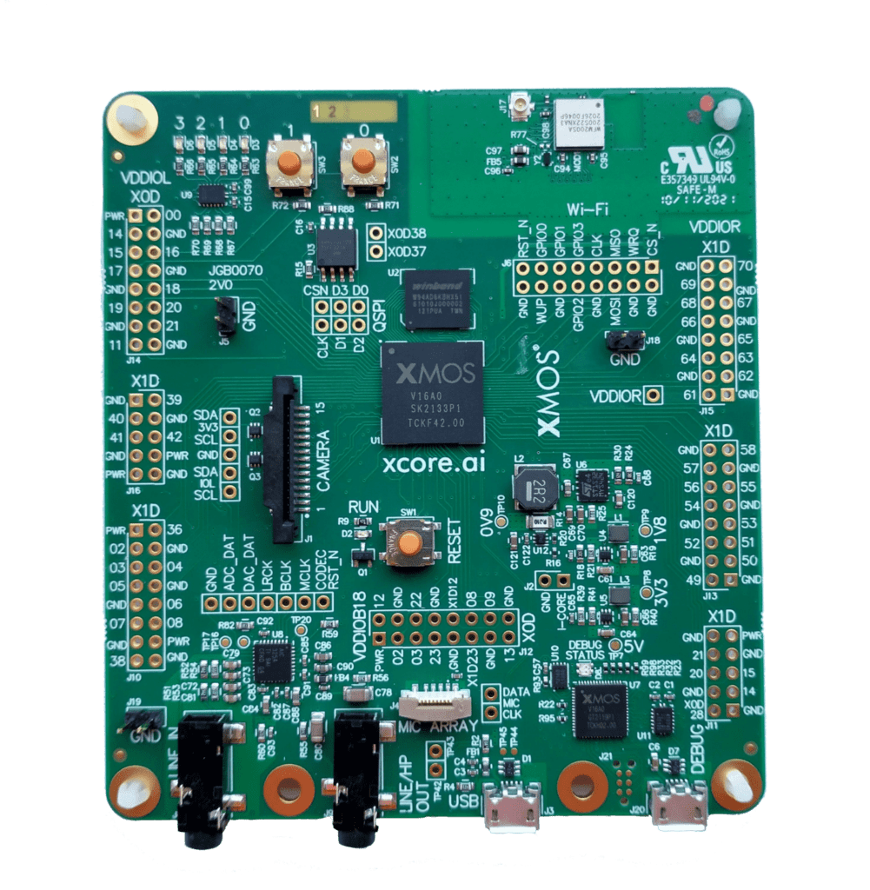

.. include:: ../../substitutions.rst

.. _sln_voice_asr_programming_guide:

####################################
Automated Speech Recognition Porting
####################################

********
Overview
********

This is the XCORE-VOICE automated speech recognition (ASR) porting example design.  This example can be used
by 3rd-party ASR developers and ISVs to port their ASR library to xcore.ai.  

The example reads a 1 channel, 16-bit, 16kHz wav file, slices it up into bricks, and calls the ASR library with each 
brick.  The default brick length is 240 samples but this is configurable.  ASR ports that implement the public API 
defined in `asr/api/asr.h` can easily be added to current and future XCORE-VOICE example designs that support speech
recognition.

An oversimplified ASR port is provided.  This ASR port recognizes the "Hello XMOS" keyword if any acoustic activity 
is observed in 75 consecutive bricks.

******************
Supported Hardware
******************

This example is supported on the `XCORE-AI-EXPLORER <https://www.xmos.ai/xcore-ai/#eval-kit>`_` board.  However, the `XK-VOICE-L71 <https://www.digikey.co.uk/en/products/detail/xmos/XK-VOICE-L71/15761172>`_ board can be supported with some minor modifications.

Setting up the Hardware
=======================

This example design requires an XCORE.AI Evaulation Kit.

Connect the XCORE.AI Evaulation Kit as described in the `xcore.ai Explorer Board Quick Start <https://www.xmos.ai/download/xcore.ai-Explorer-Board-Quick-Start(6).pdf>`_ guide.  

**********************
Obtaining the Software
**********************

TODO: Include link to source code archive download.

Alternatively, the source code can be obtained by cloning the public GitHub repository.  

.. note::

  Cloning requires a `GitHub <https://github.com>`_ account configured with `SSH key authentication <https://docs.github.com/en/authentication/connecting-to-github-with-ssh/about-ssh>`_.  

Cloning the Repository
======================

Run the following `git` command to clone the repository and all submodules:

.. code-block:: console

  git clone --recurse-submodules https://github.com/xmos/sln_voice.git

Building the Host Server
========================

This application requires a host application to serve files to the device. The served file must be named `test.wav`.  This filename is defined in `src/app_conf.h`.

Run the following commands in the root folder to build the host application using your native x86 Toolchain:

.. note::

  Permissions may be required to install the host applications.

**Linux and Mac**

.. code-block:: console

  cmake -B build_host
  cd build_host
  make xscope_host_endpoint
  make install

The host application, `xscope_host_endpoint`, will be installed at `/opt/xmos/bin`, and may be moved if desired.  You may wish to add this directory to your `PATH` variable.

Before running the host application, you may need to add the location of `xscope_endpoint.so` to your `LD_LIBRARY_PATH` environment variable.  This environment variable will be set if you run the host application in the XTC Tools command-line environment.  For more information see `Configuring the command-line environment <https://www.xmos.ai/documentation/XM-014363-PC-LATEST/html/tools-guide/install-configure/getting-started.html>`__.

**Windows**

Before building the host application, you will need to add the path to the XTC Tools to your environment.

.. code-block:: console

  set "XMOS_TOOL_PATH=<path-to-xtc-tools>"

Then build the host application:

.. code-block:: console

  cmake -G "NMake Makefiles" -B build_host
  cd build_host
  nmake xscope_host_endpoint
  nmake install

The host application, `xscope_host_endpoint.exe`, will be install at `<USERPROFILE>\.xmos\bin`, and may be moved if desired.  You may wish to add this directory to your `PATH` variable.

Before running the host application, you may need to add the location of `xscope_endpoint.dll` to your `PATH`. This environment variable will be set if you run the host application in the XTC Tools command-line environment.  For more information see `Configuring the command-line environment <https://www.xmos.ai/documentation/XM-014363-PC-LATEST/html/tools-guide/install-configure/getting-started.html>`__.

Building the Firmware
=====================

Run the following commands in the root folder to build the firmware:

**Linux and Mac**

.. code-block:: console

    cmake -B build -DCMAKE_TOOLCHAIN_FILE=xmos_cmake_toolchain/xs3a.cmake
    cd build
    make example_asr

**Windows**

.. code-block:: console

    cmake -G "NMake Makefiles" -B build -D CMAKE_TOOLCHAIN_FILE=xmos_cmake_toolchain/xs3a.cmake
    cd build
    nmake example_asr

.. _sln_voice_asr_programming_guide_flash_model:

Flashing the Model
==================

Run the following commands in the root folder to flash the model:

    xflash --quad-spi-clock 50MHz --factory example_asr.xe --boot-partition-size 0x100000 --target-file examples/speech_recognition/XCORE-AI-EXPLORER.xn --data examples/speech_recognition/asr/port/simple/simple_asr_model.dat

Running the Firmware
=====================

From the root folder run:

**Linux and Mac**

.. code-block:: console

    make run_example_asr

**Windows**

.. code-block:: console

    nmake run_example_asr

**********************
Modifying the Software
**********************

Implementing the ASR API
========================

Begin your ASR port by creating a new folder under `example/speech_recognition/asr/port`.  Be sure to include `asr/api/asr.h` in your port's main source file.  The `asr.h` file includes comments detailing the public API methods and parameters.  ASR ports that implement the public API 
defined can easily be added to current and future XCORE-VOICE example designs that support speech recognition.

Pay close attention to the `ASR_MALLOC`, `ASR_FREE`, `ASR_PRINTF`, and `ASR_READ_EXT`` macros.  ASR libraries must not call `malloc`
directly to allocate dynamic memory. Instead call the `ASR_MALLOC` and `ASR_FREE` macros which use the same function signatures as 
`malloc` and `free`.  This allows the application to provide alternative implementations of these functions - like `pvPortMalloc`
and `vPortFree` in a FreeRTOS application.  Similarly, applications should call `ASR_PRINTF` instead of `printf` or xcore's `debug_printf`.

The `ASR_READ_EXT` macro is provided to load data directly from external memory (QSPI flash or LPDDR) into SRAM. This is the recommended 
way to load coefficients or blocks of data from a model.  It is far more efficient to load the data into SRAM and perform any math on the 
data while it is in SRAM.  The The `ASR_READ_EXT`` macro has the same function signature as `memcpy`.  The caller is responsible for 
allocating the destination buffer.  

.. note::

  XMOS provides an arithmetic and DSP library which leverages the XS3 Vector Processing Unit (VPU) to accelerate costly operations on vectors of 16- or 32-bit data. Included are functions for block floating-point arithmetic, fast Fourier transforms, discrete cosine transforms, linear filtering and more.

  TODO: add link to lib_xcore_math docs and tutorial

.. note::

  To minimize SRAM scratch space usage, some ASR ports load coefficients into SRAM in chunks.  This is useful when performing a routine
  such as a vector matrix multiply as this operation can be performed on a portion of the matrix at a time.

In the current source code, the model data (and optional grammar data) are set in `src/process_file.c`.  Modify these variables to reflect your data.  

The remainder of the API should be familiar to ASR developers.  The API can be extended if necessary.

Flashing Models
===============

To flash your model, modify the `--data` argument passed to `xflash` command in the :ref:`sln_voice_asr_programming_guide_flash_model` section.

See `asr/port/simple/simple_asr_model.h` to see how the model's flash address is defined.

Placing Models in SRAM
======================

Small models (near or under 100kB in size) may be placed in SRAM.  See `asr/port/simple/simple_asr_model.h` and `asr/port/simple/simple_asr_model.c` for more information on placing your model in SRAM.  
