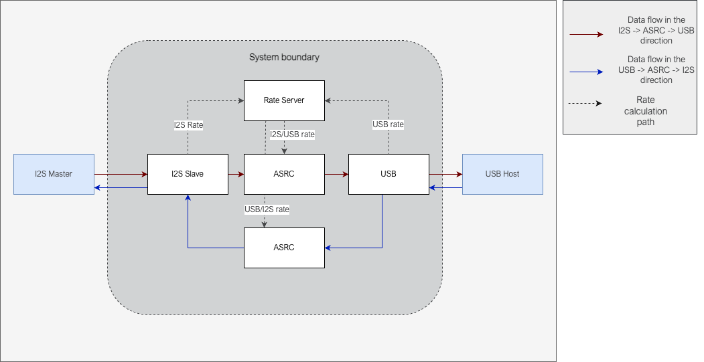

********
Overview
********

This is the |SOFTWARE_URL| Asynchronous Sampling Rate Converter (ASRC) example design.

The example system implements a stereo |I2S| Slave and a stereo Adaptive UAC2.0 interface and exchanges data between the two interfaces.
Since the two interfaces are operating in different clock domains, there is an ASRC block between them that converts from the input to the output sampling rate.
There are two ASRC blocks, one each in the |I2S| → ASRC → USB and USB → ASRC → |I2S| path, as illustrated in the :ref:`fig-asrc-top-level-label`.
The diagram also shows the rate calculation path, which monitors and computes the instantaneous ratio between the ASRC input and output sampling rate.
The rate ratio is used by the ASRC task to dynamically adapt filter coefficients using spline interpolation in its filtering stage.

.. _fig-asrc-top-level-label:

   ASRC example top level system diagram

The |I2S| Slave interface is a stereo 32 bit interface supporting sampling rates between 44.1 kHz - 192 kHz.

The USB interface is a stereo, 32 bit, 48 kHz, High-Speed, USB Audio Class 2, Adaptive interface.

The ASRC algorithm implemented in the `lib_src <https://github.com/xmos/lib_src/>`_ library is used for the ASRC processing.
The ASRC processing is block based and works on a block size of 244 samples per channel in the |I2S| → ASRC → USB path and 96 samples per channel in the USB → ASRC → |I2S| path.

Supported Hardware
==================
This example application is supported on the |HARDWARE_URL| board.
In addition to the XK-VOICE-L71 board, it requires an XTAG4 to program and debug the device.

To demonstrate the audio exchange between the |I2S| and USB interface, the XK-VOICE-L71 device needs to be connected to an |I2S| Master device.
To do this, connect the BCLK, MCLK, DOUT, DIN pins of the RASPBERRY PI HOST INTERFACE header (J4) on the XK-VOICE-L71 to the |I2S| Master.
The table :ref:`table-pin-connections-label` lists the pins on the XK-VOICE-L71 RPI header and the signals on the |I2S| Master that they need to be connected to.

.. _table-pin-connections-label:

.. list-table:: XK-VOICE-L71 RPI host interface header (J4) connections
   :widths: 30 50
   :header-rows: 1
   :align: left

   * - XK-VOICE-L71 PI header pin
     - Signal to connect to on the |I2S| Master board
   * - 12
     - BLCK output
   * - 35
     - LRCK output
   * - 38
     - |I2S| Data input to the Master
   * - 40
     - |I2S| Data output from the Master
   * - One of the GND pins (6, 14, 20, 30, 34, 9, 25 or 39)
     - GND on the |I2S| Master board

Obtaining the app files
=======================

Download the main repo and submodules using:

::

   $ git clone --recurse git@github.com:xmos/sln_voice.git
   $ cd sln_voice/

Building the app
================

First install and source the XTC version: 15.2.1 tools. The output should be
something like this:

::

   $ xcc --version
   xcc: Build 19-198606c, Oct-25-2022
   XTC version: 15.2.1
   Copyright (C) XMOS Limited 2008-2021. All Rights Reserved.

Linux or Mac
------------

To build for the first time, run ``cmake`` to create the
make files:

::

   $ mkdir build
   $ cd build
   $ cmake --toolchain ../xmos_cmake_toolchain/xs3a.cmake  ..
   $ make example_asrc_demo -j

Following initial ``cmake`` build, for subsequent builds, as long as new source files are not added, just type:

::

   $ make example_asrc_demo -j

``cmake`` needs to be rerun to discover any new source files added.

Windows
-------

It is highly recommended to use ``Ninja`` as the make system under
``cmake``. Not only is it a lot faster than MSVC ``nmake``, it also
works around an issue where certain path names may cause an issue with
the XMOS compiler under Windows.

To install Ninja, follow these steps:

-  Download ``ninja.exe`` from `here <https://github.com/ninja-build/ninja/releases>`__.
   This firmware has been tested with Ninja version v1.11.1.
-  Ensure Ninja is on the command line path. It can be added to the path
   permanently by following the steps listed
   `here <https://www.computerhope.com/issues/ch000549.htm>`__. Alternatively,
   set the path in the current command line session using something
   like ``set PATH=%PATH%;C:\Users\xmos\utils\ninja``

To build for the first time, run ``cmake`` to create the
make files:

::

   $ md build
   $ cd build
   $ cmake -G "Ninja" --toolchain  ..\xmos_cmake_toolchain\xs3a.cmake ..
   $ ninja example_asrc_demo.xe

Following initial ``cmake`` build, for subsequent builds, as long as new source files are not added, just type:

::

   $ ninja example_asrc_demo.xe

``cmake`` needs to be rerun to discover any new source files added.

Running the app
===============

To run the app, either xrun or xflash can be used. Connect the XK-VOICE-L71 board to the host and type the following
to run with real-time debug output enabled:

::

   $ xrun --xscope example_asrc_demo.xe

or to flash the application so that it always boots after a power cycle:

::

   $ xflash example_asrc_demo.xe

Operation
=========

When the example runs, the audio received by the device on the |I2S| Slave interface at the |I2S| interface sampling rate is
sample rate converted using the ASRC to the USB sampling rate and streamed out from the device over the USB interface. Similarly,
the audio streamed out by the USB host into the USB interface of the device is sample rate converted to the |I2S| interface sampling
rate and streamed out from the device over the |I2S| Slave interface.

This example supports dynamic changes of the |I2S| interface sampling frequency at runtime. It detects the |I2S| sampling rate change and reconfigures
the system for the new rate.

|newpage|
