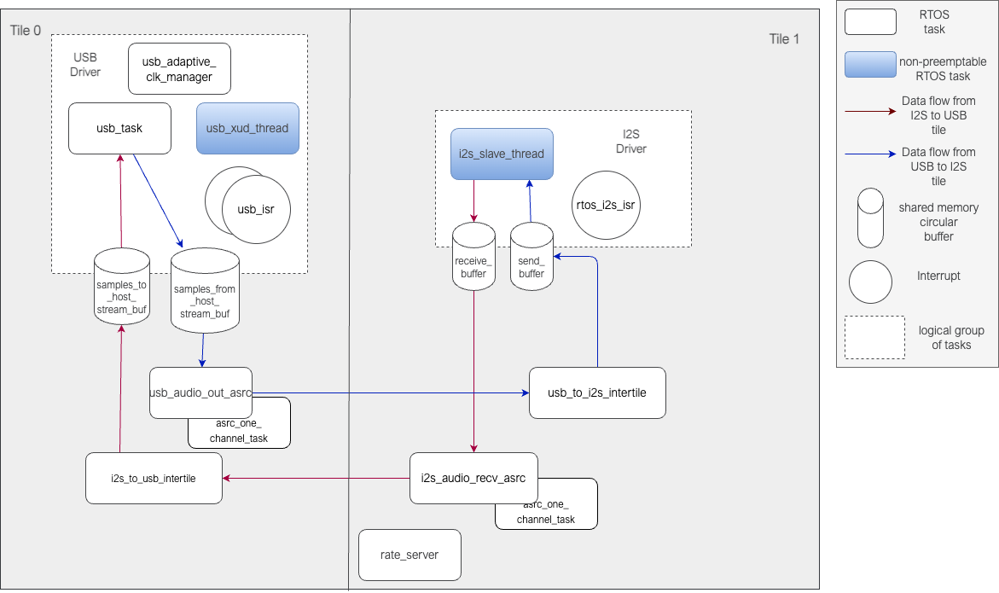
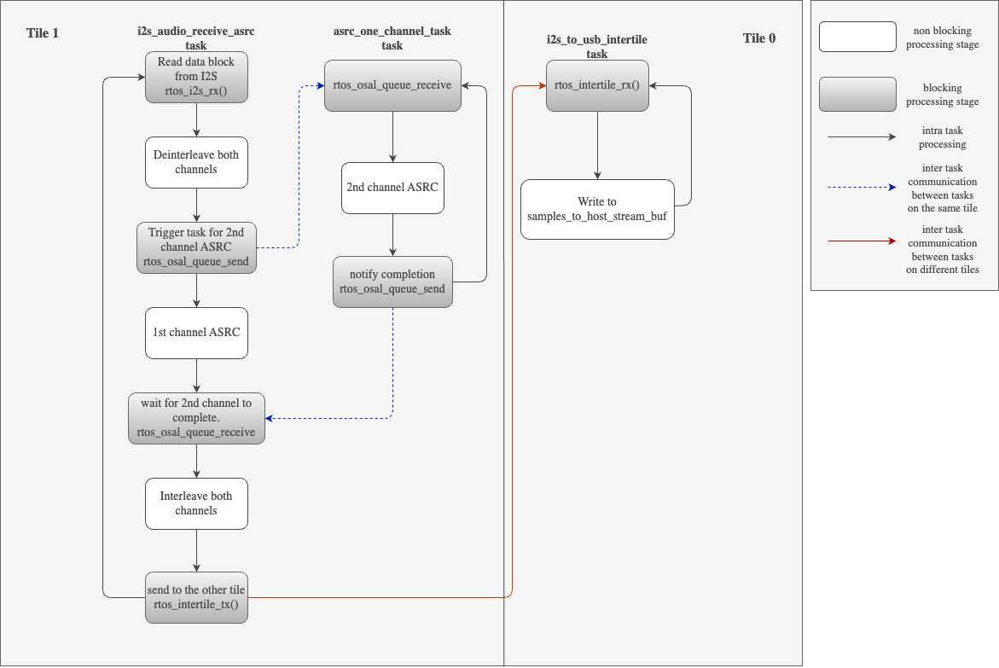
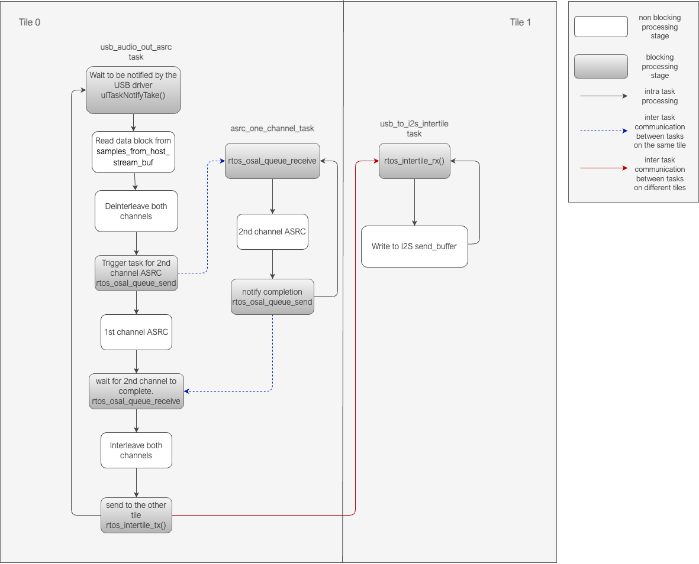
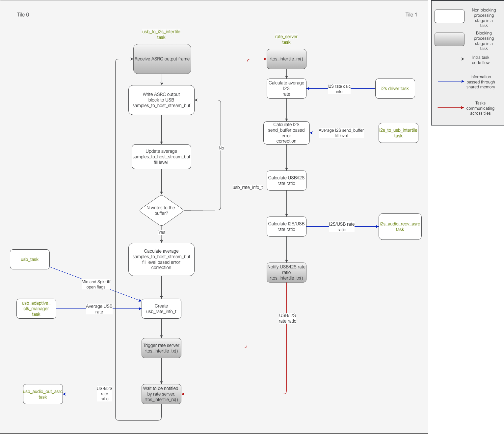

*********************
Software Architecture
*********************

The ASRC demo application is a two tile application developed to run on the XK-VOICE-L71 board running at a core frequency of 600 MHz.

It is a FreeRTOS based application where all the application blocks are implemented as FreeRTOS tasks.

Each tile has 5 bare metal cores dedicated to running RTOS tasks and since all processing is done within RTOS tasks, each core has 120 MHz of bandwidth
available.

Task diagram
============

The :ref:`fig-ASRC-task-diagram-label` shows the RTOS tasks and other components that make up the system.

.. _fig-ASRC-task-diagram-label:

   ASRC example task diagram

The tasks can roughly be categorised as belonging to the USB driver, |I2S| driver or the application code categories.
The actual ASRC processing happens in four tasks across the two tiles; the **usb_audio_out_asrc task**, **i2s_audio_recv_asrc** task, and two instances of **asrc_one_channel_task**, one on each tile.
This is described in more detail in the :ref:`application-components-label` section below.

Most of the tasks are involved in the ASRC processing data path, while a few are involved in monitoring the input and output data rates
and computing the rate ratio, which is the ratio between the frequencies at the input and output of the ASRC tasks.
The rate ratio is provided to the ASRC tasks every ``asrc_process_frame()`` call. Details about the rate ratio calculation are described in the :ref:`rate-server-label` section below.

USB Driver components
=====================

This application presents a stereo, 48 kHz, 32 bit, high-speed, Adaptive UAC2.0 USB interface.
It has two endpoints, Endpoint 0 for control and Endpoint 1 for bidirectional isochronous USB audio.
The USB application level driver is `TinyUSB <https://docs.tinyusb.org/en/latest/>`_ based.

The **usb_xud_thread**, **usb_isr**, **usb_task** and **usb_adaptive_clk_manager** implement the USB driver.
Together, these tasks handle the USB communication with the host and also monitor the average USB rate seen by the device.
The average USB rate is used for calculating the rate ratios that are
sent to the ``asrc_process_frame()`` function. This is described more in the :ref:`rate-server-label` section.

The **usb_xud_thread** runs ``XUD_Main`` which implements the USB HIL driver. It runs on a dedicated bare metal core so cannot be preempted by other RTOS tasks.
It interfaces with the USB app level thread (**usb_task**) via shared memory and dedicated channels between the ``XUD_Main`` and each endpoint.

``XUD_Main`` notifies the connected endpoint of a USB transfer completion through an interrupt on the respective channel. This interrupt is serviced by the **usb_isr** routine.

**usb_task** implements the app level USB driver functionality. The app level USB driver is based on `TinyUSB <https://docs.tinyusb.org/en/latest/>`_ which hooks into the application by means of callback functions.
The **usb_isr** task is triggered by the interrupt and parses the data transferred from XUD and places it on a queue that the **usb_task** blocks on for further processing.
For example, on completion of an EP1 OUT transfer, the transfer completion gets notified on the **usb_xud_thread → usb_isr → usb_task** path,
and the **usb_task** calls the ``tud_audio_rx_done_post_read_cb()`` function to have the application process the data received from the host.
On completion of an EP1 IN transfer, the transfer completion again follows the **usb_xud_thread → usb_isr → usb_task** path, and **usb_task** calls the ``tud_audio_tx_done_pre_load_cb()``
callback function to have the application load the EP1 IN data for the next transfer.

**samples_to_host_stream_buf** and **samples_from_host_stream_buf** are circular buffers shared between the application and the USB driver and allow for decoupling one from the other.
The data frame received over USB from the host is written to the ``samples_from_host_stream_buf`` by the TinyUSB callback function ``tud_audio_rx_done_post_read_cb()``,
while the application reads ``USB_TO_I2S_ASRC_BLOCK_LENGTH`` samples of data out of it.
Similarly, the application writes the ASRC output block of data to the ``samples_to_host_stream_buf`` while the TinyUSB callback function ``tud_audio_tx_done_pre_load_cb()``
reads from it to send one frame of data to the USB host.

**usb_adaptive_clk_manager** task is responsible for calculating the average USB rate as seen by the device. The average rate is calculated over a 16-second moving window.
The averaging smooths out any jitter seen in the USB SOF timestamps that are used for calculating the rate.

|I2S| Driver components
=======================

This application presents a stereo 32 bit, |I2S| Slave interface that supports |I2S| sampling rates of 44.1, 48, 88.2, 96, 176.4 and 192 kHz.
The |I2S| driver supports tracking dynamic sampling rate (SR) changes and recalculates the nominal sampling rate after detecting a SR change event.
It also continuously monitors the timespan over which a fixed number of samples are received. This information is then used by the application for
calculating the average |I2S| rate seen by the device.

**i2s_slave_thread**, |I2S| **send_buffer** and **receive_buffer** and **rtos_i2s_isr** make up the |I2S| driver components.

**i2s_slave_thread** implements the |I2S| HIL driver. The HIL level driver calls into the application callback functions for ``i2s_init()``, ``i2s_restart_check()``, ``i2s_receive()`` and ``i2s_send()``.
These functions, in addition to handling |I2S| send and receive data, also detect sampling rate changes and gather information for tracking the average sampling rate.

|I2S| **send_buffer** and **receive_buffer** are circular buffers shared between the driver and the application and contain data received over |I2S| (``receive_buffer``) and data the application wants to send over |I2S| (``send_buffer``).
These buffers allow for decoupling the |I2S| HIL driver from the ASRC application. The driver reads from and writes to these buffers at the |I2S| sample rate while the application can read and write blocks of data to these buffers equal to the ASRC input or output block size.

The application calls ``rtos_i2s_rx()`` to read ``I2S_TO_USB_ASRC_BLOCK_LENGTH`` samples of data from the ``receive_buffer``. The **i2s_slave_thread** independently calls ``i2s_receive()`` callback function to write a sample of data as it gets received over |I2S|.

Similarly, the application calls ``rtos_i2s_tx()`` to write ASRC output size block of data into the ``send_buffer``. Meanwhile, the driver independently calls the callback function ``i2s_send()`` to read a sample of data to send over the |I2S|.

**rtos_i2s_isr** interrupt is used to ensure that the application calls to ``rtos_i2s_rx()`` and ``rtos_i2s_tx()`` block only on RTOS primitives when waiting for read data to be available or buffer space to be available when writing data.

.. _application-components-label:

Application components
======================

**usb_audio_out_asrc**, **i2s_audio_recv_asrc**, **asrc_one_channel_task**, **usb_to_i2s_intertile**, **i2s_to_usb_intertile** and the **rate_server** tasks make up the non-driver components of the application.

**usb_audio_out_asrc** performs ASRC on data received from the USB host to the device. It waits to get notified by the TinyUSB callback function ``tud_audio_rx_done_post_read_cb()`` when there are one or more ASRC input blocks (96 USB samples) of data in the ``samples_from_host_stream_buf``.
It does ASRC processing of the first channel while coordinating with the **asrc_one_channel_task** for processing the second channel in parallel and sends the processed output to the other tile on the inter-tile context.

**i2s_audio_recv_asrc** performs ASRC on data received over the |I2S| interface by the device. It blocks on the ``rtos_i2s_rx()`` function to receive one ASRC input block (244 |I2S| samples) of data from |I2S| and performs ASRC on one channel
while coordinating with the **asrc_one_channel_task** for processing the second channel in parallel. It then sends the processed output to the other tile on the inter-tile context.

**asrc_one_channel_task** performs ASRC on a single channel of data. There is one of these on each tile. It waits on an RTOS message queue for an ASRC input block to be available, does ASRC processing on the block and posts the completion notification on another message queue.

**usb_to_i2s_intertile** task receives the ASRC output data generated by **usb_audio_out_asrc** over the inter-tile context onto the |I2S| tile and writes it to the |I2S| ``send_buffer``.
It has other rate-monitoring related responsibilities that are described in the :ref:`rate-server-label` section.

**i2s_to_usb_intertile** task receives the ASRC output data generated by **i2s_audio_recv_asrc** over the inter-tile context onto the USB tile and writes it to the USB ``samples_to_host_stream_buf``.
It has other rate-monitoring related responsibilities that are described in the :ref:`rate-server-label` section.

The :ref:`asrc_i2s_to_usb_data_path-label` diagram shows the application tasks involved in the |I2S| → ASRC → USB path processing and their interaction with each other.

.. _asrc_i2s_to_usb_data_path-label:

   |I2S| → ASRC → USB data path

The :ref:`asrc_usb_to_i2s_data_path-label` diagram shows the application tasks involved in the USB → ASRC → |I2S| path processing and their interaction with each other.

.. _asrc_usb_to_i2s_data_path-label:

   USB → ASRC → |I2S| data path

.. _rate-server-label:

**rate_server**
---------------
The ASRC ``process_frame`` API requires the caller to calculate and send the instantaneous ratio between the ASRC input and output rate. The **rate_server** is responsible for calculating these rate ratios for both USB → ASRC → |I2S| and |I2S| → ASRC → USB directions.

Additionally, the application also monitors the average buffer fill levels of the buffers holding ASRC output to prevent any overflows or underflows of the respective buffer. A gradual drift in the buffer fill level indicates that the rate ratio is being under or over calculated by the **rate_server**.
This could happen either due to jitter in the actual rates or precision limitations when calculating the rates.

The average fill level of the buffer is monitored and a closed-loop error correction factor is calculated to keep the buffer level at an expected stable level.
The error estimated based on the buffer fill level is used to compute the estimated rate ratio from the initial rate ratio. This estimated rate ratio is then sent to the ASRC ``process_frame()`` API.

.. code-block:: console

    estimated_rate_ratio = initial_rate_ratio + buffer_based_correction_factor

The **rate_server** runs on the |I2S| tile (tile 1) and is periodically triggered from the USB tile (tile 0) by the **usb_to_i2s_intertile** task. The **rate_server** is triggered once after every 16 frames are written to the ``samples_to_host_stream_buf``.

The following information is needed for calculating the rate ratios:

1. The average |I2S| rate
2. The average USB rate
3. An error factor computed based on the USB ``samples_to_host_stream_buf`` fill level
4. An error factor computed based on the |I2S| ``send buffer`` fill level
5. A USB ``mic_interface_open`` flag indicating if the USB host is streaming out from the device,
   since the rate ratio in the |I2S| -> ASRC -> USB direction is calculated only when the host is reading data from the device
6. A USB ``spkr_interface_open`` flag indicating if the USB host is streaming into the device,
   since the rate ratio in the USB -> ASRC -> |I2S| direction is calculated only when the host is sending data to the device

Of the above, the USB related information (2, 3, 5 and 6 above) is available on the USB tile. When triggering the **rate_server**, the **i2s_to_usb_intertile** task gets this information,
either calculating it or getting it through shared memory from other USB tasks on the same tile, and sends it to the **rate_server** over the inter-tile context using the structure below.

.. code-block:: console

    typedef struct
    {
        int64_t buffer_based_correction;
        float_s32_t usb_data_rate;
        bool mic_itf_open;
        bool spkr_itf_open;
    }usb_rate_info_t;

The |I2S| related information (1 and 4 above) is calculated in the **rate_server** itself with information available for calculating these available through shared memory from other tasks on this tile.

After calculating the rates, the **rate_server** sends the rate ratio for the USB → ASRC → |I2S| side to the **usb_to_i2s_intertile** task over the inter-tile context and it is made available to the
**usb_audio_out_asrc** task through shared memory. The |I2S| → ASRC → USB side rate ratio is also made available to the **i2s_audio_recv_asrc** task through shared memory since it runs on the same tile as the rate server.

The :ref:`fig-rate-server-label` diagram shows the code flow during the rate ratio calculation process, focussing on the **usb_to_intertile** task that triggers the **rate_server** and the **rate_server** task where the rate ratios are calculated.

.. _fig-rate-server-label:

   Rate calculation code flow

Handling |I2S| sampling rate change events
==========================================

The |I2S| driver monitors the |I2S| nominal rate and provides this information to the application. When an |I2S| sampling rate change happens:

* The ASRC instances on both tiles are re-initialised with the new sampling rate.
* The buffers that are used for buffer-fill-level based correction are reset. Streaming out of them is paused while zeroes are sent out over both USB and |I2S|.
  Once the buffers fill to a stable level, streaming out from them resumes.
* The average buffer level calculation state is reset and the average buffer level calculation starts afresh.
  New stable buffer levels are also calculated and the buffer levels are now corrected against these new stable averages.

Note that the device starts with the nominal |I2S| sampling rate set to zero. Device startup therefore follows the same path as an |I2S| sampling rate change where the sampling rate goes from zero to first detected nominal sampling rate.
Everything described above therefore also applies to the device startup behaviour.

Handling USB speaker interface close -> open events
===================================================

When the USB host stops streaming to the device and then starts again, this event is detected through calls to the ``tud_audio_set_itf_close_EP_cb`` and ``tud_audio_set_itf_cb`` functions.
The ASRC output buffer in the USB → ASRC → |I2S| path (|I2S| ``send_buffer``) is reset.
Zeroes are then sent over |I2S| until the buffer fills to a stable level, when we resume streaming out of this buffer to send samples over |I2S|.
The average buffer calculation state for the |I2S| ``send_buffer`` is also reset and a new stable average is calculated against which the average buffer levels are corrected.

Handling USB mic interface close -> open events
===============================================

If the USB host stops streaming from the device and then starts again, this event is detected through calls to the ``tud_audio_set_itf_close_EP_cb`` and ``tud_audio_set_itf_cb`` functions.
The ASRC output buffer in the |I2S| → ASRC → USB is reset (USB ``samples_to_host_stream_buf``).
Zeroes are streamed to the host until the buffer fills to a stable level, when we resume streaming out of this buffer to send samples over USB.
The average buffer calculation state for the USB ``samples_to_host_stream_buf`` is also reset and a new stable average is calculated against which the average buffer levels are corrected.
