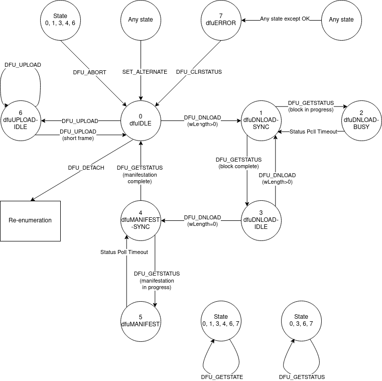
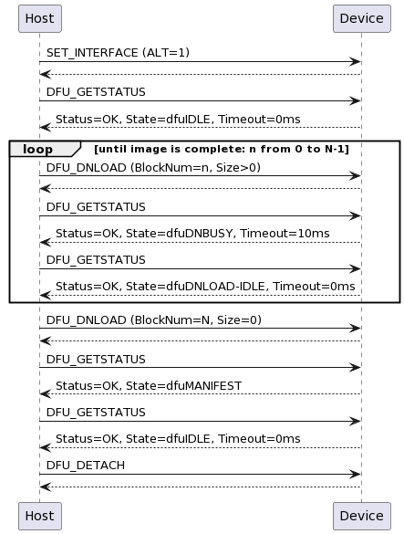
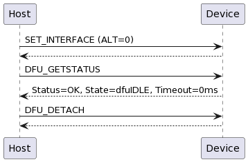
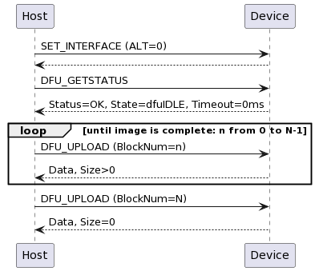
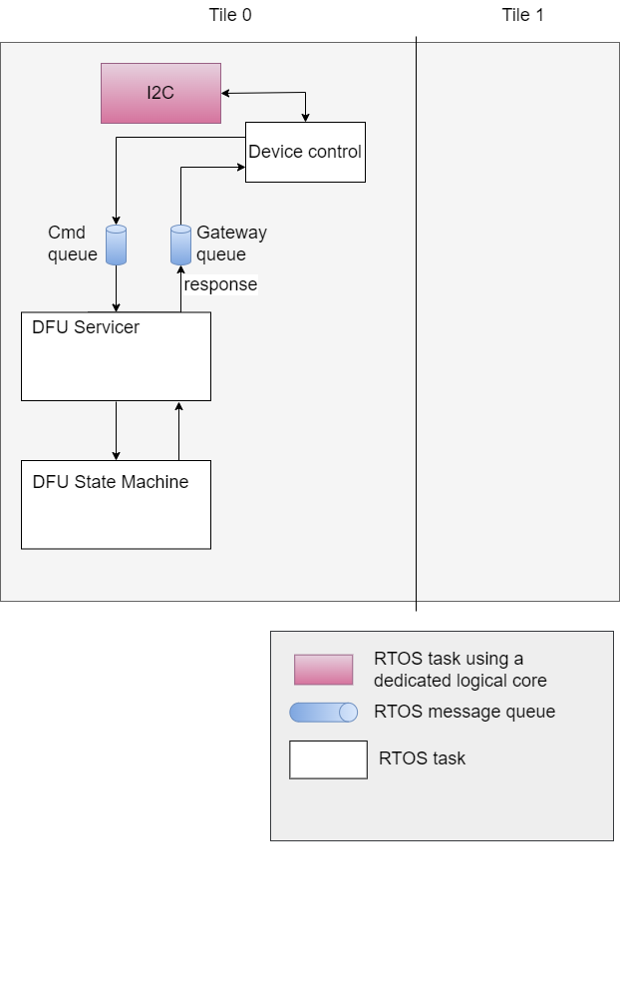
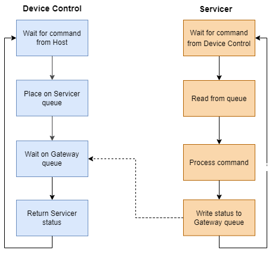
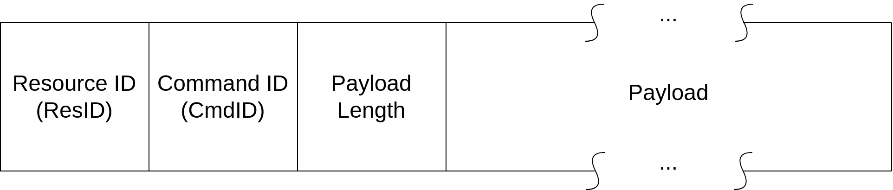

****************
Host Integration
****************

This example design can be integrated with existing solutions or modified to be a single controller solution.

Out of the Box Integration
==========================

Out of the box integration varies based on configuration.

INT requires |I2S| connections to the host.  Refer to the schematic, connecting the host reference audio playback to the ADC |I2S| and the host input audio to the DAC |I2S|.  Out of the box, the INT configuration requires an externally generated MCLK of 12.288 MHz.  24.576 MHz is also supported and can be changed via the compile option MIC_ARRAY_CONFIG_MCLK_FREQ, found in ffva_int.cmake.

UA requires a USB connection to the host.

Support for ASR engine
======================

The ``example_ffva_int_cyberon_fixed_delay`` provides an example about how to include an ASR engine, the  Cyberon DSPotter™.

Most of the considerations made in the :ref:`section about the FFD devices<sln_voice_ffd_overview>` are still valid for the FFVA example. The only notable difference is that the pipeline output in the FFVA example
is on the same tile as the ASR engine, i.e. tile 0.

.. note::

    Both the audio pipeline and the ASR engine process use the same sample block length. ``appconfINTENT_SAMPLE_BLOCK_LENGTH`` and ``appconfAUDIO_PIPELINE_FRAME_ADVANCE`` are both 240.

More information about the Cyberon engine can be found in  :ref:`sln_voice_ffd_speech_recognition_cyberon` section.

An additional configuration with an integrated ASR engine is an application that receive the audio via the an I2S interface, and it forwards the samples to the integrated ASR engine without any audio processing.
This example can be built by following the steps below:

 #. set *appconfI2S_AUDIO_SAMPLE_RATE* to either 16000 or 48000 (Hz) in ``examples/ffva/ffva_int_cyberon.cmake``
 #. set *appconfUSE_I2S_INPUT* to 1 in ``examples/ffva/ffva_int_cyberon.cmake``, this replaces the microphone audio with the I2S audio as input to the intent engine
 #. build and run the build config ``example_ffva_int_cyberon_empty``

|newpage|

*******************
Design Architecture
*******************

The application consists of a PDM microphone input which is fed through the XMOS-VOICE DSP blocks.  The output ASR channel is then output over |I2S| or USB.

.. figure:: diagrams/ffva_diagram.drawio.png
   :align: center
   :scale: 80 %
   :alt: ffva diagram

.. _dfu_design:

***********************************
Device Firmware update (DFU) Design
***********************************

The Device Firmware Update (DFU) allows updating the firmware of the device from a host computer,
and it can be performed over |I2C| or USB. This interface closely follows the principles set out in
`version 1.1 of the Universal Serial Bus Device Class Specification for Device
Firmware Upgrade <https://www.usb.org/sites/default/files/DFU_1.1.pdf>`_, including implementing
the state machine and command structure described there.

The DFU process is internally managed by the DFU controller module within the firmware.
This module is tasked with overseeing the DFU state machine and executing DFU operations.
The list of states and transactions are represented in the diagram in :numref:`dfu_state_machine`.

.. _dfu_state_machine:

  State diagram of the DFU operations

The main differences with the state diagram in `version 1.1 of Universal Serial Bus Device Class Specification for Device Firmware Upgrade <https://www.usb.org/sites/default/files/DFU_1.1.pdf>`_ are:

  * the ``appIDLE`` and ``appDETACH`` states are not implemented, and the device is started in the ``dfuIDLE`` state
  * the device goes into the ``dfuIDLE`` state when a ``SET_ALTERNATE`` message is received
  * the device is rebooted when a ``DFU_DETACH`` command is received.

The DFU allows the following operations:

  * download of an upgrade image to the device
  * upload of factory and upgrade images from the device
  * reboot of the device.

The rest of this section describes the message sequence charts of the supported operations.

A message sequence chart of the download operation is below:

  Message sequence chart of the download operation

.. note::

  The end of the image transfer is indicated by a ``DFU_DNLOAD`` message of size 0.

.. note::

  The ``DFU_DETACH`` message is used to trigger the reboot.

.. note::

  For the |I2C| implementation, specification of the block number in download is not supported; all downloads must start with block number 0 and must be run to completion. The device will track this progress internally.

A message sequence chart of the reboot operation is below:

  Message sequence chart of the reboot operation

.. note::

  The ``DFU_DETACH`` message is used to trigger the reboot.

.. raw:: latex

    \newpage

A message sequence chart of the upload operation is below:

  Message sequence chart of the upload operation

.. note::

  The end of the image transfer is indicated by a ``DFU_UPLOAD`` message of size less than the transport medium maximum; this is 4096 bytes in UA and 128 bytes in INT.

.. _dfu_usb_interface_design:

DFU over USB implementation
===========================

The UA variant of the device makes use of a USB connection for handling DFU operations.
This interface is a relatively standard, specification-compliant implementation.
The implementation is encapsulated within the tinyUSB library, which provides a USB stack for the |project|.

.. _dfu_i2c_interface_design:

DFU over |I2C| implementation
=============================

The INT variant of the device presents a DFU interface that may be controlled
over |I2C|.

:numref:`fig_control_plane_components` shows the modules involved in
processing the DFU commands. The *I2C* task has a dedicated logical core so that it is always ready
to receive and send control messages. The DFU state machine is driven by the control commands. The DFU state
machine interacts with a separate RTOS task in
order to asynchronously perform flash read/write operations.

.. _fig_control_plane_components:

  |project| Control Plane Components Diagram

.. raw:: latex

    \newpage

:numref:`fig_control_plane_dc_servicer_flow_chart` shows the interaction
between the Device Control module and the DFU Servicer.
In this diagram, boxes with the same colour reside in the same RTOS task.

.. _fig_control_plane_dc_servicer_flow_chart:

  |project| Device Control -- Servicer Flow Chart

This diagram shows a critical aspect of the DFU control operation.
The Device Control module, having placed a command on a Servicer's command
queue, waits on the Gateway queue for a response.
As a result, it ensures processing of a single control command at a time.
Limiting DFU control operation to a single command in-flight reduces the
complexity of the control protocol and eliminates several potential error
cases.

The FFVA-INT uses a packet protocol to receive control commands and send each
corresponding response.
Because packet transmission occurs over a very short-haul transport, as in
|I2C|, the protocol does not include fields for error detection or correction such as start-of-frame and
end-of-frame symbols, a cyclical redundancy check or an error correcting code.
:numref:`fig_control_plane_packet` depicts the structure of each packet.

.. _fig_control_plane_packet:

  |project| Control Plane Packet Diagram

Packets containing a response from the FFVA-INT to the host application place
a status value in the first byte of the payload.

Mirroring the USB DFU specification, the INT DFU implementation supports a set of 9
control commands intended to drive the state machine, along with an additional 2
utility commands:

.. _tab_dfu_cmds:
.. csv-table:: DFU commands
    :class: longtable
    :file: ./tables/dfu_cmds_table.csv
    :widths: 25, 3, 8, 24, 40
    :header-rows: 1

These commands are then used to drive the state machine described in the
:ref:`Device Firmware update (DFU) Design<dfu_design>`.

When writing a custom compliant host application, the use of XMOS' **fwk_rtos**
library is advised; the **device_control** library provided there gives a host
API that can communicate effectively with the FFVA-INT. A description of the |I2C| bus activity
during the execution of the above DFU commands is provided below, in the
instance that usage of the **device_control** library is inconvenient or
impossible.

The FFVA-INT |I2C| address is set by default as 0x42. This may be
confirmed by examination of the ``appconf_CONTROL_I2C_DEVICE_ADDR`` define in the
``platform_conf.h`` file. The |I2C| address may also be altered by editing this file.
The DFU resource has an internal "resource ID" of 0xF0. This maps to the
register that read/write operations on the DFU resource should target -
therefore, the register to write to will always be 0xF0.

To issue a write command (e.g. DFU_SETALTERNATE):

* First, set up a write to the device address. For a default device
  configuration, a write operation will always start by a write token to 0x42
  (START, 7 bits of address [0x42], R/W bit [0 to specify write]), wait for ACK,
  followed by specifying the register to write [Resource ID 0xF0]
  (and again wait for ACK).
* Then, write the command ID (in this example, 64 [0x40]) from the above table.
* Then, write the total transfer size, *including the register byte*. In this
  example, that will be 4 bytes (register byte, command ID, length byte, and 1
  byte of payload), so write 0x04.
* Finally, send the payload - e.g. 1 to set the alternate setting to "upgrade".
* The full sequence for this write command will therefore be START, 7 bits of
  address [0x42], 0 (to specify write), hold for ACK, 0xF0, hold for ACK, 0x40,
  hold for ACK, 0x04, hold for ACK, 0x01, hold for ACK, STOP.
* To complete the transaction, the device must then be queried; set up a read to
  0x42 (START, 7 bits of address [0x42], R/W bit [1 to specify read], wait for
  ACK). The device will clock-stretch until it is ready, at which point it will
  release the clock and transmit one byte of status information. This will be a
  value from the enum ``control_ret_t`` from ``device_control_shared.h``,
  found in ``modules\rtos\modules\sw_services\device_control\api``.

To issue a read command (e.g. DFU_GETSTATUS):

* Set up a write to the device; as above, this will mean sending START,
  7 bits of device address [0x42], 0 (to specify write), hold for ACK. Send the
  DFU resource ID [0xF0], hold for ACK.
* Then, write the command ID (in this example, 3), bitwise ANDed with 0x80 (to
  specify this as a read command) - in this example therefore 0x83 should be
  sent, and hold for ACK.
* Then, write the total length of the expected reply. In this example, the
  command has a payload of 5 bytes. The device will also prepend the payload
  with a status byte. Therefore, the expected reply length will be 6 bytes
  [0x06]. Hold for ACK.
* Then, issue a repeated START. Follow this with a read from the device:
  the repeated START, 7 bits of device address [0x42], 1 (to specify read), hold
  for ACK. The device will clock-stretch until it is ready. It will then send
  a status byte (from the enum ``control_ret_t`` as described above), followed
  by a payload of requested data - in this example, the device will send 5
  bytes. ACK each received byte. After the last expected byte, issue a STOP.

It is heavily advised that those wishing to write a custom host application to
drive the DFU process for the FFVA-INT over |I2C| familiarise themselves with
`version 1.1 of the Universal Serial Bus Device Class Specification for Device
Firmware Upgrade <https://www.usb.org/sites/default/files/DFU_1.1.pdf>`_.

|newpage|
