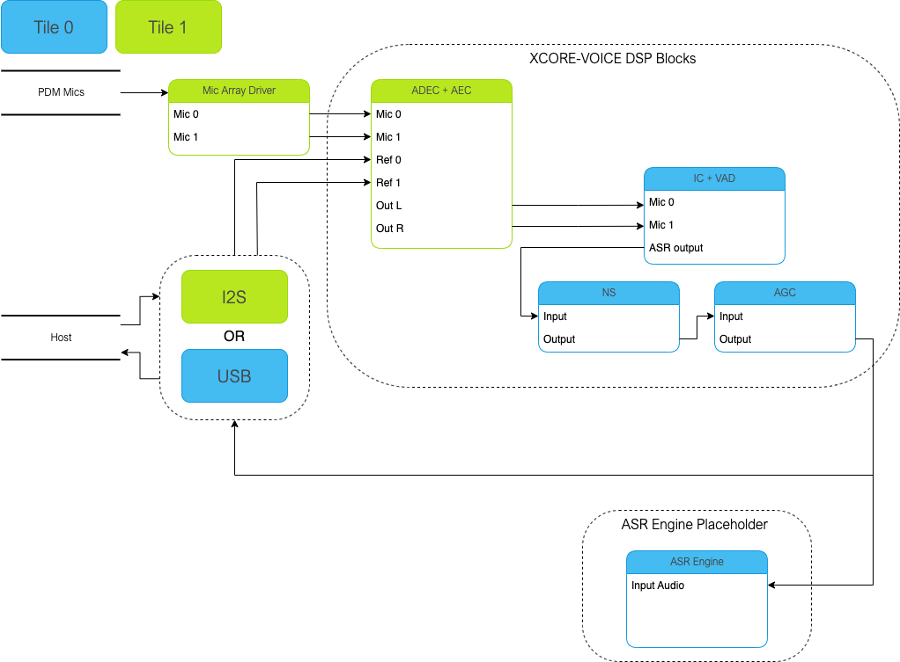

****************
Host Integration
****************

This example design can be integrated with existing solutions or modified to be a single controller solution.

Out of the Box Integration
==========================

Out of the box integration varies based on configuration.

INT requires |I2S| connections to the host.  Refer to the schematic, connecting the host reference audio playback to the ADC |I2S| and the host input audio to the DAC |I2S|.  Out of the box, the INT configuration requires an externally generated MCLK of 12.288 MHz.  24.576 MHz is also supported and can be changed via the compile option MIC_ARRAY_CONFIG_MCLK_FREQ, found in ffva_int.cmake.

UA requires a USB connection to the host.

Single Controller Solution
==========================

In a single controller solution, a user can populate the model runner manager task with the application specific code.

This dummy thread receives only the ASR channel output, which has been downshifted to 16 bits.

The user must ensure the streambuffer is emptied at the rate of the audio pipeline at minimum, otherwise samples will be lost.

Populate:

.. code-block:: c
    :caption: Model Runner Dummy (model_runner.c)

    void model_runner_manager(void *args)
    {
        StreamBufferHandle_t input_queue = (StreamBufferHandle_t)args;

        int16_t buf[appconfWW_FRAMES_PER_INFERENCE];

        /* Perform any initialization here */

        while (1)
        {
            /* Receive audio frames */
            uint8_t *buf_ptr = (uint8_t*)buf;
            size_t buf_len = appconfWW_FRAMES_PER_INFERENCE * sizeof(int16_t);
            do {
                size_t bytes_rxed = xStreamBufferReceive(input_queue,
                                                         buf_ptr,
                                                         buf_len,
                                                         portMAX_DELAY);
                buf_len -= bytes_rxed;
                buf_ptr += bytes_rxed;
            } while(buf_len > 0);

            /* Perform inference here */
            // rtos_printf("inference\n");
        }
    }

|newpage|

*******************
Design Architecture
*******************

The application consists of a PDM microphone input which is fed through the XMOS-VOICE DSP blocks.  The output ASR channel is then output over |I2S| or USB.

|newpage|
