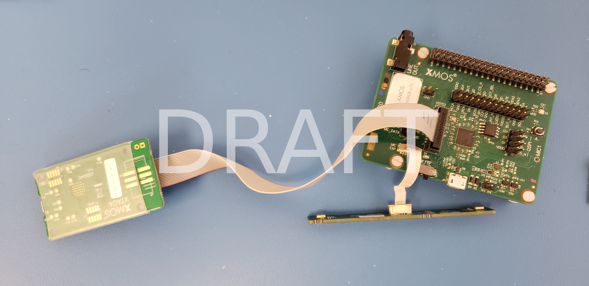
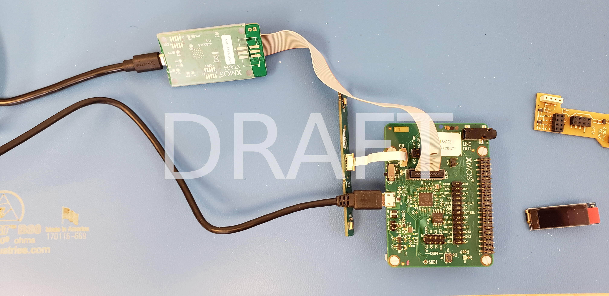

******************
Supported Hardware
******************

This example application is supported on the `XK-VOICE-L71 <https://www.digikey.co.uk/en/products/detail/xmos/XK-VOICE-L71/15761172>`_ board.

Setting up the Hardware
=======================

This example design requires an XTAG4 and XK-VOICE-L71 board.

xTAG
----

The xTAG is used to program and debug the device

Connect the xTAG to the debug header, as shown below.

Connect the micro USB XTAG4 and micro USB XK-VOICE-L71 to the programming host.

|newpage|
