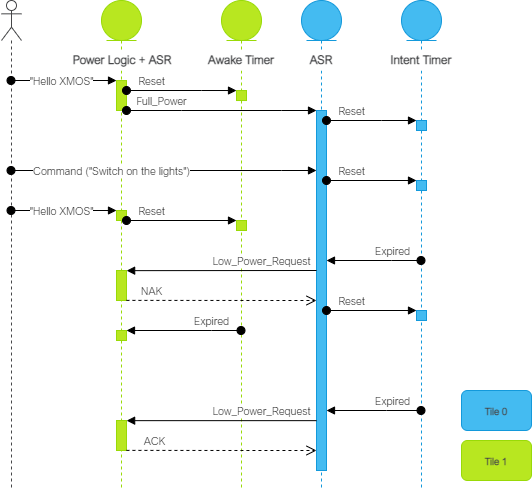

.. _sln_voice_low_power_ffd_overview:

********
Overview
********

The low power far-field voice local command (Low Power FFD) example design targets low power
speech recognition using Sensory's TrulyHandsfree™ (THF) speech recognition and local dictionary.

When the small wake word model running on tile 1 recognizes a wake word utterance, the device
transitions to full power mode where tile 0's command model begins receiving audio samples,
continuing the command recognition process. On command recognition, the application outputs a
discrete message over |I2C| and UART.

Tile 0's command model, in combination with a timer, determines when to request a transition to low
power. Tile 1 may accept or reject this request based on its own timer that is reset on wake word
recognitions and potentially other application-specific events. The figure below illustrates the
general behavior.

When in low power mode, tile 0 is effectively disabled along with any peripheral/IO associated with
that tile.

Sensory's THF software ships with an expiring development license. It will suspend recognition
after 11.4 hours or 107 recognition events; after which, a device reset is required to resume
normal operation. To perform a reset, either power cycle the device or press the SW2 button.
Note that SW2 is only functional while in full power mode (this application is configured to hold
the device in full-power mode on such license expiration events).

More information on the Sensory speech recognition library can be found here: :ref:`sln_voice_low_power_ffd_speech_recognition`

|newpage|
