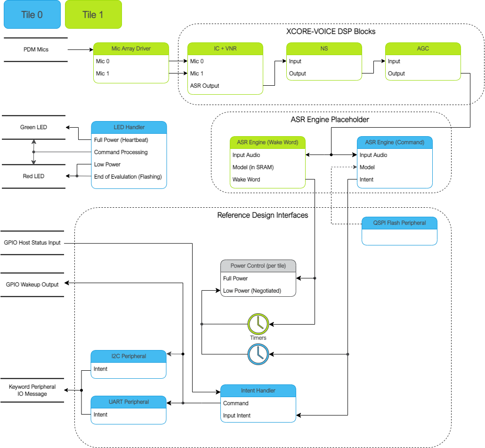
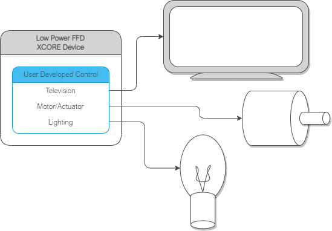

|newpage|

**********************
Software Modifications
**********************

The Low Power FFD example design consists of four major software blocks: the audio pipeline,
ASR engine (wake word and intent engines), intent handler, and power control. This section will go
into detail on how to replace each subsystem.

It is highly recommended to be familiar with the application as a whole before attempting replacing
these functional units. This information can be found here:
:ref:`sln_voice_low_power_ffd_software_description`

See :ref:`sln_voice_low_power_ffd_software_description` for more details on the memory footprint and
CPU usage of the major software components.

Replacing XCORE-VOICE DSP Block
-------------------------------

The audio pipeline can be replaced by making changes to the `audio_pipeline.c` file.

It is up to the user to ensure that the input and output frames of the audio pipeline remain the
same, or the remainder of the application will not function properly.

This section will walk through an example of replacing the XMOS NS stage, with a custom stage foo.

Declaration and Definition of DSP Context
^^^^^^^^^^^^^^^^^^^^^^^^^^^^^^^^^^^^^^^^^

Replace:

.. code-block:: c
    :caption: XMOS NS (audio_pipeline.c)

    typedef struct ns_stage_ctx {
        ns_state_t state;
    } ns_stage_ctx_t;

    static ns_stage_ctx_t ns_stage_state = {};

With:

.. code-block:: c
    :caption: Foo (audio_pipeline.c)

    typedef struct foo_stage_ctx {
        /* Your required state context here */
    } foo_stage_ctx_t;

    static foo_stage_ctx_t foo_stage_state = {};

DSP Function
^^^^^^^^^^^^

Replace:

.. code-block:: c
    :caption: XMOS NS (audio_pipeline.c)

    static void stage_ns(frame_data_t *frame_data)
    {
    #if appconfAUDIO_PIPELINE_SKIP_NS
        (void) frame_data;
    #else
        int32_t ns_output[appconfAUDIO_PIPELINE_FRAME_ADVANCE];
        configASSERT(NS_FRAME_ADVANCE == appconfAUDIO_PIPELINE_FRAME_ADVANCE);
        ns_process_frame(
                    &ns_stage_state.state,
                    ns_output,
                    frame_data->samples[0]);
        memcpy(frame_data->samples, ns_output, appconfAUDIO_PIPELINE_FRAME_ADVANCE * sizeof(int32_t));
    #endif
    }

With:

.. code-block:: c
    :caption: Foo (audio_pipeline.c)

    static void stage_foo(frame_data_t *frame_data)
    {
        int32_t foo_output[appconfAUDIO_PIPELINE_FRAME_ADVANCE];
        foo_process_frame(
                    &foo_stage_state.state,
                    foo_output,
                    frame_data->samples[0]);
        memcpy(frame_data->samples, foo_output, appconfAUDIO_PIPELINE_FRAME_ADVANCE * sizeof(int32_t));
    }

Runtime Initialization
^^^^^^^^^^^^^^^^^^^^^^

Replace:

.. code-block:: c
    :caption: XMOS NS (audio_pipeline.c)

    ns_init(&ns_stage_state.state);

With:

.. code-block:: c
    :caption: Foo (audio_pipeline.c)

    foo_init(&foo_stage_state.state);

Audio Pipeline Setup
^^^^^^^^^^^^^^^^^^^^

Replace:

.. code-block:: c
    :caption: XMOS NS (audio_pipeline.c)

    const pipeline_stage_t stages[] = {
        (pipeline_stage_t)stage_vnr_and_ic,
        (pipeline_stage_t)stage_ns,
        (pipeline_stage_t)stage_agc,
    };

    const configSTACK_DEPTH_TYPE stage_stack_sizes[] = {
        configMINIMAL_STACK_SIZE + RTOS_THREAD_STACK_SIZE(stage_vnr_and_ic) + RTOS_THREAD_STACK_SIZE(audio_pipeline_input_i),
        configMINIMAL_STACK_SIZE + RTOS_THREAD_STACK_SIZE(stage_ns),
        configMINIMAL_STACK_SIZE + RTOS_THREAD_STACK_SIZE(stage_agc) + RTOS_THREAD_STACK_SIZE(audio_pipeline_output_i),
    };

With:

.. code-block:: c
    :caption: Foo (audio_pipeline.c)

    const pipeline_stage_t stages[] = {
        (pipeline_stage_t)stage_vnr_and_ic,
        (pipeline_stage_t)stage_foo,
        (pipeline_stage_t)stage_agc,
    };

    const configSTACK_DEPTH_TYPE stage_stack_sizes[] = {
        configMINIMAL_STACK_SIZE + RTOS_THREAD_STACK_SIZE(stage_vnr_and_ic) + RTOS_THREAD_STACK_SIZE(audio_pipeline_input_i),
        configMINIMAL_STACK_SIZE + RTOS_THREAD_STACK_SIZE(stage_foo),
        configMINIMAL_STACK_SIZE + RTOS_THREAD_STACK_SIZE(stage_agc) + RTOS_THREAD_STACK_SIZE(audio_pipeline_output_i),
    };

It is also possible to add or remove stages. Refer to the RTOS Framework documentation on the
generic pipeline sw_service.

.. _sln_voice_low_power_ffd_replacing-keyword-engine-block:

Replacing ASR Engine Block
--------------------------

Replacing the keyword spotter engine has the potential to require significant changes due to various
feature extraction input requirements and varied output logic.

The generic intent engine API only requires two functions be declared:

.. code-block:: c
    :caption: Intent API (intent_engine.h)

    /* Generic interface for intent engines */
    int32_t intent_engine_create(uint32_t priority, void *args);
    int32_t intent_engine_sample_push(asr_sample_t *buf, size_t frames);

Refer to the existing Sensory model implementation for details on how the output handler is set up,
how the audio is conditioned to the expected model format, and how it receives frames from the audio
pipeline.

Replacing Example Design Interfaces
-----------------------------------

It may be desired to have a different output interface to talk to a host, or not have a host at all
and handle the intent local to the XCORE device.

Different Peripheral IO
^^^^^^^^^^^^^^^^^^^^^^^

To add or remove a peripheral IO, modify the bsp_config accordingly. Refer to documentation inside
the RTOS Framework on how to instantiate different RTOS peripheral drivers.

|newpage|

Direct Control
^^^^^^^^^^^^^^

In a single controller system, the XCORE can be used to control peripherals directly.

The proc_keyword_res task can be modified as follows:

.. code-block:: c
    :caption: Intent Handler (intent_handler.c)

    static void proc_keyword_res(void *args) {
        QueueHandle_t q_intent = (QueueHandle_t) args;
        int32_t id = 0;

        while(1) {
            xQueueReceive(q_intent, &id, portMAX_DELAY);

            /* User logic here */
        }
    }

This code example will receive the ID of each intent, and can be populated by any user application
logic. User logic can use other RTOS drivers to control various peripherals, such as screens,
motors, lights, etc, based on the intent engine outputs.

|newpage|

Replacing Example Power Control Logic
-------------------------------------

Depending on the peripherals used in the end application, the requirements and handling of the
power control/state logic may need adaptation. The power control logic operates in a task where a
state machine that is common to both tiles is used. During steady state, each tile is expected to
remain is the same state. During transitions each tile executes its own state transition logic.
Below outlines the various functions that may need adaptation for a given application.

.. code-block:: c
    :caption: Locking drivers (power_control.c)

    static void driver_control_lock(void)
    {
    #if ON_TILE(POWER_CONTROL_TILE_NO)
        rtos_osal_mutex_get(&gpio_ctx_t0->lock, RTOS_OSAL_WAIT_FOREVER);
    #else
        rtos_osal_mutex_get(&qspi_flash_ctx->mutex, RTOS_OSAL_WAIT_FOREVER);
        /* User logic here */
    #endif
    }

.. code-block:: c
    :caption: Unlocking drivers (power_control.c)

    static void driver_control_unlock(void)
    {
    #if ON_TILE(POWER_CONTROL_TILE_NO)
        rtos_osal_mutex_put(&gpio_ctx_t0->lock);
    #else
        /* User logic here */
        rtos_osal_mutex_put(&qspi_flash_ctx->mutex);
    #endif
    }

This implementation also includes function calls that are for evaluation/diagnosis purposes and may
be removed for end applications. This includes calls to:

- led_indicate_awake
- led_indicate_asleep

When removing these calls, the associated call to `power_control_ind_complete` must either be moved
to another location in the application (this is currently handled in led.c's `led_task`) or logic
associated with `TASK_NOTIF_MASK_LP_IND_COMPLETE` should be removed/disabled. The `power_control_ind_complete`
routine provides a basic means for the power control task to wait for another asynchronous process
to complete before proceeding with the state transition logic.

|newpage|
