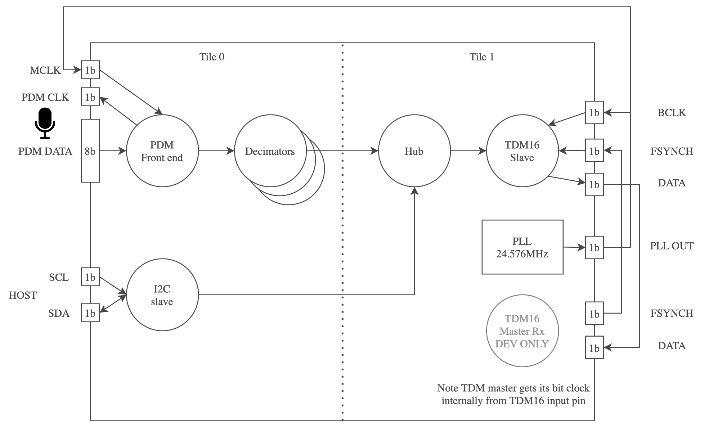
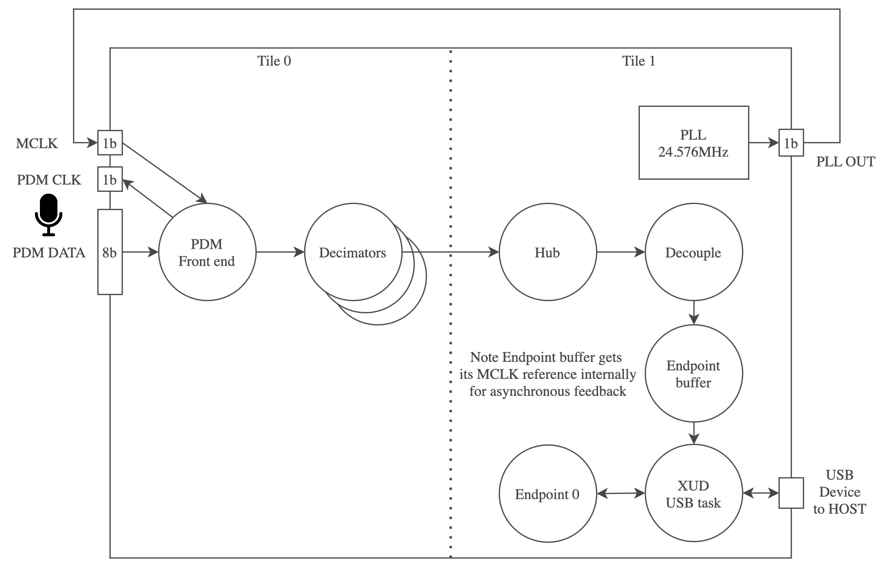

.. _sln_voice_mic_aggregator_programming_guide:

.. include:: ../../../examples/mic_aggregator/README.rst

Operation
=========

The design consists of a number of tasks connected via the xcore-ai silicon communication channels.
The decimators in the microphone array are configured to produce a 48 kHz PCM output. 
The 16 output channels are loaded into a 16 slot TDM slave peripheral running at 24.576 MHz bit
clock or a USB Audio Class 2 asynchronous interface and are optionally
amplified. The TDM build also provides a simple I2C slave interface to allow
gains to be controlled at run-time. The USB build supports USB Audio Class 2 compliant volume controls.

For the TDM build, a simple TDM16 master peripheral is included as well as a local
24.576 MHz clock source so that mic_array and TDM16 slave operation may be tested
standalone through the use of jumper cables. These may be removed when
integrating into a system with TDM16 master supplied.

Software Architecture
=====================

The applications are written on bare metal and use logical cores (hardware threads)
to implement the functional blocks. Each of the tasks are connected using channels provided in the
xcore-ai architecture. The thread diagrams are shown in :numref:`agg_tdm` and :numref:`agg_usb`.

.. _agg_tdm:

   Microphone Aggregator TDM Thread Diagram

.. _agg_usb:

   Microphone Aggregator USB Thread Diagram

PDM Capture
-----------

Both the TDM and USB aggregator examples share a common PDM front end. This consists of an 8 bit port 
with each data line connected to two PDM microphones each configured to provide data
on a different clock edge. The 3.072 MHz clock for the PDM microphones is provided by the xcore-ai
device on a 1 bit port and clocks all PDM microphones. The PDM clock is divided down from the 24.576 MHz
local MCLK.

The data collected by the 8 bit port is sent to the lib_mic_array block which de-interleaves 
the PDM data streams and performs decimation of the PDM data down to 48 kHz 32 bit PCM samples.
Due to the large number of microphones the PDM capture stage uses four hardware threads on tile[0]; one for the microphone
capture and three for decimation. This is needed to divide the processing workload and meet timing comfortably.

Samples are forwarded to the next stage at a rate of 48 kHz resulting in a packet of 16
PCM samples per exchange.

Audio Hub
---------

The 16 channels of 48 kHz PCM streams are collected by `Hub` and are amplified using a
saturated gain stage. The initial gain is set to 100, since a gain of 1 sounds very
quiet due to the mic_array output being scaled to allow acoustic
overload of the microphones without clipping within the decimators. This value can be 
overridden using the ``MIC_GAIN_INIT`` define in `app_conf.h`.

Additionally for the TDM configuration, the `Hub` task also checks for control packets
from I2C which may be used to dynamically update the individual gains at runtime.

A single hardware thread contains the task and a triple buffer scheme is used to ensure there is always
a free buffer available to write into regardless of the relative phase between the production
and consumption of microphone samples.

The `Hub` task has plenty of timing slack and is a suitable place for adding signal processing
if needed.

TDM Host Connection
-------------------

The TDM build supports a 16-slot TDM slave Tx peripheral from the fwk_io sub-module. In this application
it runs at 24.576 MHz bit clock which supports 16 channels of 32 bit, 48 kHz samples per frame. 

The TDM component uses a single hardware thread. 

For the purpose of debugging a simple TDM 16 Master Rx component is provided. This allows the transmitted
TDM frames from the application to be received and checked without having to connect an external
TDM Master. It may be deleted / disconnected without affecting the core application.

.. note::
    The simple TDM 16 Master Rx component is not regression tested and is for evaluation of TDM 16 Slave Tx in this application only.

USB Host Connection
-------------------

As an alternative to TDM, a USB host connection is also supported. The USB connection uses the following specifications:

- USB High Speed (480 Mbps)
- USB Audio Class 2.0
- Asynchronous mode (audio clock is provided by the firmware)
- 24 bit Audio slots
- 48 kHz Sample Rate

The USB host connection functionality is provided by lib_xua which is the core library of XMOS's USB Audio solution.

The USB Audio subsection uses a total of four hardware threads in this application.

Resource Usage
==============

The xcore-ai device has a total resource count of 2 x 524288 Bytes of memory and 2 x 8 hardware threads across two tiles.
This application uses around half of the processing resources and a tiny fraction of the available memory 
meaning there is plenty of space inside the chip for additional functionality if needed.

TDM Build
---------

===== ======== =======
Tile   Memory  Threads
===== ======== =======
  0    25996      5
  1    22812      2*
Total  48808      7 
===== ======== =======

* An additional debug TDM Master thread is used on Tile[1] by default which is not needed in a practical deployment.

USB Build
---------

===== ======== =======
Tile   Memory  Threads
===== ======== =======
  0    24252      4
  1    52116      5
Total  76368      9 
===== ======== =======

Board Configuration
===================

Make the following connections between headers using flying leads:

===============     ================    ==============================================
Host Connection     Board Connection    Note
===============     ================    ==============================================
MIC CLK             J14 ‘00’            This is the microphone clock which is to be sent to the PDM microphones from J14.
MIC DATA            J14 ‘14’            This is the data line for microphones 0 and 8. See below.
I2S LRCLK           J10 ‘36’            This is the FSYCNH input for TDM slave. J10 ‘36’ is the TDM master FSYNCH output for the application.
I2S MCLK            I2S BCLK            MCLK is the 24.576MHz clock which directly drives the BCLK input for the TDM slave.
I2S DAC             J10 ‘38’            I2S DAC is the TDM Slave Tx out which is read by the TDM Master Rx input on J10.
===============     ================    ==============================================

To access other microphone inputs use the following:

======== =======
Mic pair J14 pin
======== =======
0, 8     14
1, 9     15
2, 10    16
3, 11    17
4, 12    18
5, 13    19
6, 14    20
7, 15    21
======== =======

For I2C control, make the following connections:

===============     ================
Host Connection     Board Connection
===============     ================
SCL IOL             Your I2C host SCL.
SDA IOL             Your I2C host SDA.
GND                 Your I2C host ground.
===============     ================

The I2C slave is tested at 100 kHz SCL.

I2C Controlled Volume
=====================

For the TDM build, there are 32 registers which control the gain of each of the 16 output
channels. The 8 bit registers contain the upper 8 bit and lower 8 bit of the
microphone gain respectively. The initial gain is set to 100, since 1 is
quiet due to the mic_array output being scaled to allow acoustic
overload of the microphones without clipping. Typically a gain of a few
hundred works for normal conditions. The gain is only applied after the
lower byte is written.

The gain applied is saturating so no overflow will occur, only clipping.

======== ==========================
Register Value
======== ==========================
0        Channel 0 upper gain byte
1        Channel 0 lower gain byte
2        Channel 1 upper gain byte
3        Channel 1 lower gain byte
4        Channel 2 upper gain byte
5        Channel 2 lower gain byte
6        Channel 3 upper gain byte
7        Channel 3 lower gain byte
8        Channel 4 upper gain byte
9        Channel 4 lower gain byte
10       Channel 5 upper gain byte
11       Channel 5 lower gain byte
12       Channel 6 upper gain byte
13       Channel 6 lower gain byte
14       Channel 7 upper gain byte
15       Channel 7 lower gain byte
16       Channel 8 upper gain byte
17       Channel 8 lower gain byte
18       Channel 9 upper gain byte
19       Channel 9 lower gain byte
20       Channel 10 upper gain byte
21       Channel 10 lower gain byte
22       Channel 11 upper gain byte
23       Channel 11 lower gain byte
24       Channel 12 upper gain byte
25       Channel 12 lower gain byte
26       Channel 13 upper gain byte
27       Channel 13 lower gain byte
28       Channel 14 upper gain byte
29       Channel 14 lower gain byte
30       Channel 15 upper gain byte
31       Channel 15 lower gain byte
======== ==========================

If using a raspberry Pi as the I2C host you may use the following
commands:

::

   $ i2cset -y 1 0x3c 0 0 #Set the gain on mic channel 0 to 50
   $ i2cset -y 1 0x3c 1 50 #Set the gain on mic channel 0 to 50

   $ i2cget -y 1 0x3c 0 #Get the upper byte of gain on mic channel 0
   $ i2cget -y 1 0x3c 1 #Get the lower byte of gain on mic channel 0

   $ i2cset -y 1 0x3c 16 1 #Set the gain on mic channel 8 to 256
   $ i2cset -y 1 0x3c 15 0 #Set the gain on mic channel 8 to 256