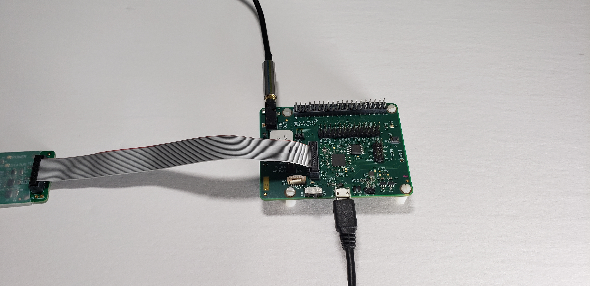

.. include:: ../../substitutions.rst
.. include:: <isonum.txt>

.. _sln_voice_ffd_quick_start:

#############################
Far-field Voice Local Command
#############################

********
Overview
********

These are the XCORE-VOICE far-field local control example designs demonstrating:

- 2-microphone far-field voice control with |I2C| or UART interface 
- Audio pipeline including interference cancelling and noise suppression 
- 16-phrase English language speech recognition

***************
Example designs
***************

Demonstration
===============================

This is the far-field voice local command (FFD) example design with Wanson speech recognition and local dictionary.

When a wakeword phrase is detected followed by an command phrase, the application will output an audio response and a discrete message over |I2C| and UART.

This software is an evaluation version only.  It includes a mechanism that limits the maximum number of recognitions to 50. You can reset the counter to 0 by restarting or rebooting the application.  The application can be rebooted by power cycling or pressing the SW2 button.

**Requirements**

- XK-VOICE-L71 board
- Powered speaker(s) with 3.5mm jack connection (OPTIONAL)

Hardware Setup
--------------

This example design requires an XTAG4 and XK-VOICE-L71 board.

.. image:: ../../shared/images/all_components.jpg
  :width: 800
  :alt: all components

Connect the xTAG to the debug header, as shown below.

.. image:: ../../shared/images/xtag_installation.jpg
  :width: 800
  :alt: xtag

Connect the micro USB XTAG4 and micro USB XK-VOICE-L71 to the programming host.

.. image:: ../../shared/images/host_setup.jpg
  :width: 800
  :alt: programming host setup

Speakers (OPTIONAL)
^^^^^^^^^^^^^^^^^^^

This example application features audio playback responses.  Speakers can be connected to the LINE OUT on the XK-VOICE-L71.

  
Running the Demonstration
-------------------------

Flashing the Firmware
^^^^^^^^^^^^^^^^^^^^^

Connect the XTAG4 via USB to the host computer running the XTC tools, and power on the board directly via USB.

On the host computer, open a ``XTC Tools Command Prompt``.

.. code-block:: console

    xflash --quad-spi-clock 50MHz --factory example_ffd.xe --boot-partition-size 0x100000 --data example_ffd_data_partition.bin

Being returned to the prompt means flashing has completed, and the XTAG4 may be disconnected.

Speech Recognition
^^^^^^^^^^^^^^^^^^

Speak one of the wakewords followed by one of the commands from the lists below.

There are three LED states:

- Flashing Green    = Waiting for Wake Word
- Solid Red & Green = Waiting for or Processing Command
- Fast Flashing Red = Evaluation period has expired

The application resets waiting for the wakeword (flashing green). Upon recognizing 'Hello XMOS,' waiting begins for a command (solid red & green).
After a period of inactivity, or successful command processing the application returns to waiting for wakeword (flashing green).

**Wakewords**

- Hello XMOS

**Dictionary Commands**

- Switch on the TV
- Switch off the TV
- Channel up
- Channel down
- Volume up
- Volume down
- Switch on the lights
- Switch off the lights
- Brightness up
- Brightness down
- Switch on the fan
- Switch off the fan
- Speed up the fan
- Slow down the fan
- Set higher temperature
- Set lower temperature
