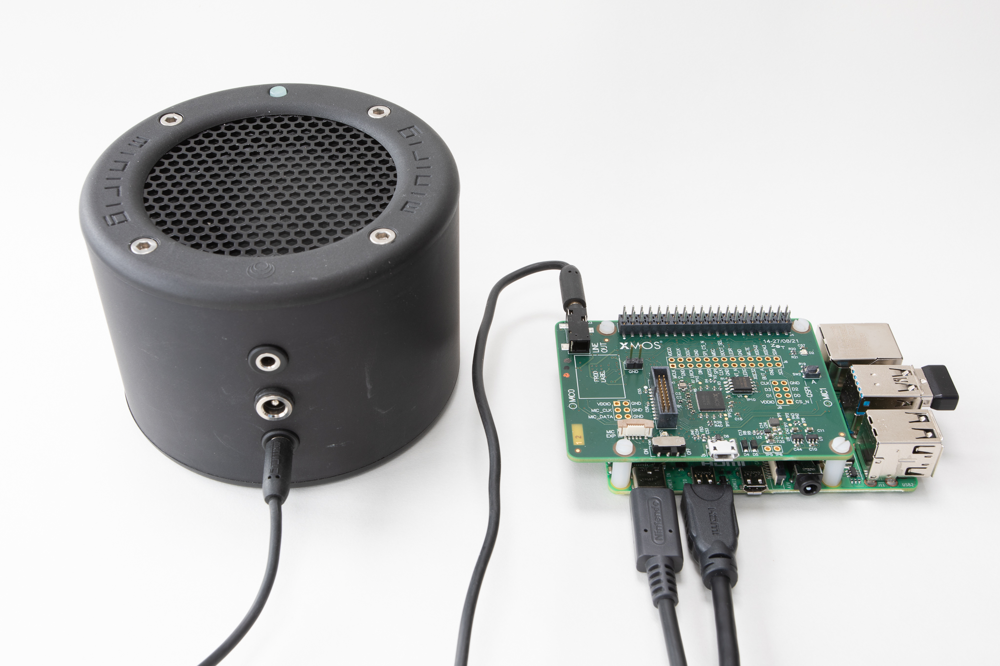

.. include:: ../../substitutions.rst
.. include:: <isonum.txt>

.. _sln_voice_ffva_quick_start:

#########################
Far-field Voice Assistant
#########################

********
Overview
********

These are the XCORE-VOICE far-field voice assistant example designs demonstrating:

- 2-microphone far-field voice assistant front-end
- Audio pipeline including echo cancelation, interference cancelling and noise suppression
- Stereo reference input and voice assistant output each supported as |I2S| or USB (UAC2.0)    

This application can be used out of the box as a voice processor solution, or extended to run local wakeword engines.

These applications features a full duplex acoustic echo cancellation stage, which can be provided reference audio via |I2S| or USB audio.  An audio output ASR stream is also available via |I2S| or USB audio.

***************
Example designs
***************

USB Audio Demonstration
=======================

Direct connection over USB to the host PC allowing signal analysis and evaluation.

**Requirements**

- XK-VOICE-L71 board
- Powered speaker(s) with 3.5mm jack connection
- Host system running Windows, macOS, Linux or Android
- USB A to Micro cable for connection to the host

Hardware Setup
--------------

Connect either end of the ribbon cable to the XTAG4, and the other end to the XK-VOICE-L71 board as shown (Image shows piggybacked connection to RPi. Standalone operation is also supported):

.. image:: images/XMOS_XK_VOICE_L71_Rev2_5N2A8560_2048px.jpg
  :width: 800
  :alt: XK-VOICE-L71 on RPi with ribbon cable

Running the Demonstration
-------------------------

Configure the Hardware
^^^^^^^^^^^^^^^^^^^^^^

Connect the host system to the micro-USB socket, and the speakers to the jack plug as shown:

.. image:: images/XMOS_XK_VOICE_L71_Rev2_5N2A8765_2048px.jpg
  :width: 800
  :alt: XK-VOICE-L71 connected to powered speakers and host device

Either mono or stereo speakers may be used.

Flashing the Firmware
^^^^^^^^^^^^^^^^^^^^^

Connect the XTAG4 via USB to the host computer running the XTC tools, and power on the board (either via RPi or directly via USB).

On the host computer, open a ``XTC Tools Command Prompt``.

.. code-block:: console

    xflash --quad-spi-clock 50MHz --factory example_ffva_ua_adec.xe --boot-partition-size 0x100000 --data example_ffva_ua_adec_data_partition.bin

Being returned to the prompt means flashing has completed, and the XTAG4 may be disconnected.

Record Captured Voice
^^^^^^^^^^^^^^^^^^^^^

1. Open a music player on host PC, and play a stereo file.

2. Check music is playing through powered speakers.

3. Adjust volume using music player or speakers.

4. Open Audacity and configure to communicate with kit. Input Device: XCORE-VOICE Voice Processor and Output Device: XCORE-VOICE Voice Processor

5. Set recording channels to 2 (Stereo) in Device

.. image:: images/channels_dropdown.png
  :width: 800
  :alt: audacity channels dropdown
  
6. Set Project Rate to 48000Hz in Selection Toolbar.

.. image:: images/audacity-rate.png
  :width: 230
  :alt: audacity bitrate setting
  
7. Click Record (press 'r') to start capturing audio streamed from the XCORE-VOICE device.

8. Talk over music; move around the room while talking.

9. Stop music player.

10. Click Stop (press space) to stop recording. Audacity records single audio channel streamed from the XCORE-VOICE kit including extracted voice signal.

11. Click dropdown menu next to Audio Track, and select Split Stereo To Mono.

.. image:: images/split-track-to-mono.jpg
  :width: 400
  :alt: audacity split action dropdown
  
12. Click Solo on left channel of split processed audio. Increase Gain slider if necessary.

.. image:: images/solo-gain.png
  :width: 400
  :alt: audacity solo and gain options
  
13. Click Play (press space) to playback processed audio.

Only your voice is audible. Playback music is removed by acoustic echo cancellation; voice is isolated by interference canceller; background noise is removed by noise suppression algorithms.

Alexa Voice Service (AVS) Demonstration
=======================================

Integration into RPi system, using I2S, running an Alexa Voice Service (AVS) client.

**Requirements**

- XK-VOICE-L71 board
- Powered speaker(s) with 3.5mm jack connection
- Raspberry Pi model 3 or 4 with power unit
- HDMI monitor, USB keyboard and mouse
- SD card (minimum 16GB size)
- Amazon Developer Account

Hardware Setup
--------------

Connect either end of the ribbon cable to the XTAG4, and the other end to the XK-VOICE-L71 board as shown (Image shows piggybacked connection to RPi. Standalone operation is also supported):

.. image:: images/XMOS_XK_VOICE_L71_Rev2_5N2A8560_2048px.jpg
  :width: 800
  :alt: XK-VOICE-L71 on RPi with ribbon cable

Connect the XV-VOICE-L71 to the Raspberry Pi ensuring that the connector fully lines up, as shown below.

.. image:: images/XMOS_XK_VOICE_L71_Rev2_5N2A8559_2048px.jpg
  :width: 800
  :alt: XK-VOICE-L71 piggybacked on RPi

Running the Demonstration
-------------------------

Flashing the Firmware
^^^^^^^^^^^^^^^^^^^^^

Connect the XTAG4 via USB to the host computer running the XTC tools, and power on the board (either via RPi or directly via USB).

On the host computer, open a ``XTC Tools Command Prompt``.

Navigate to the root directory of the sln_voice repository.

Run the following commands to flash the firmware.

.. code-block:: console

    xflash --quad-spi-clock 50MHz --factory example_ffva_int_adec.xe --boot-partition-size 0x100000 --data example_ffva_int_adec_data_partition.bin

Being returned to the prompt means flashing has completed, and the XTAG4 may be disconnected.

Prepare the Raspberry Pi System
^^^^^^^^^^^^^^^^^^^^^^^^^^^^^^^

.. note:: The FFVA-INT firmware is compatible with XVF3610-INT software, therefore instructions for installing the XVF3610-INT pi software can be followed for this AVS demo. The "Firmware Upgrade" section may be dismissed, as your FFVA-INT firmware is already updated per the above section of this guide.

.. note:: While 'apt update' will break the install, the user can and must 'apt-get update' before the auto_install.sh script is called, or package installation will fail.

Prepare the Raspberry Pi System image on the SD card by following the instructions for XVF3610-INT as described on `github <https://github.com/xmos/vocalfusion-avs-setup>`_

Connect the System
^^^^^^^^^^^^^^^^^^

Connect the speakers (into the XV-VOICE-71), HDMI monitor cable, and mouse as shown:

  
Install and Configure
^^^^^^^^^^^^^^^^^^^^^

Install the Amazon Alexa SDK and configure the Raspberry Pi Audio by following the instructions here:

`AVS Setup Instructions <https://github.com/xmos/vocalfusion-avs-setup>`_

Run Demo and Test Virtual Assistant Functionality
^^^^^^^^^^^^^^^^^^^^^^^^^^^^^^^^^^^^^^^^^^^^^^^^^

1. Once installation is complete, avsrun will run on startup. Otherwise, run the demo by typing ``avsrun`` in a terminal. The demo will now operate as an Alexa virtual assistant.

2. After successful device authorization, avsrun always displays 'Alexa is currently idle!' while waiting for the user.

3. Tap to talk can be used to simulate wakeword functionality. Type 't' and hit Enter, and avsrun displays 'Listening...'

4. The device waits a short time for a query. Try speaking "What is the weather?" and avsrun displays 'Thinking...'

5. Soon after, the virtual assistant should audibly answer over speaker as avsrun displays 'Speaking...'

6. Barge-in may also be tested. Before the assistant has finished speaking, Type 't' and hit Enter. The assistant will stop and await a new command.

|newpage|
