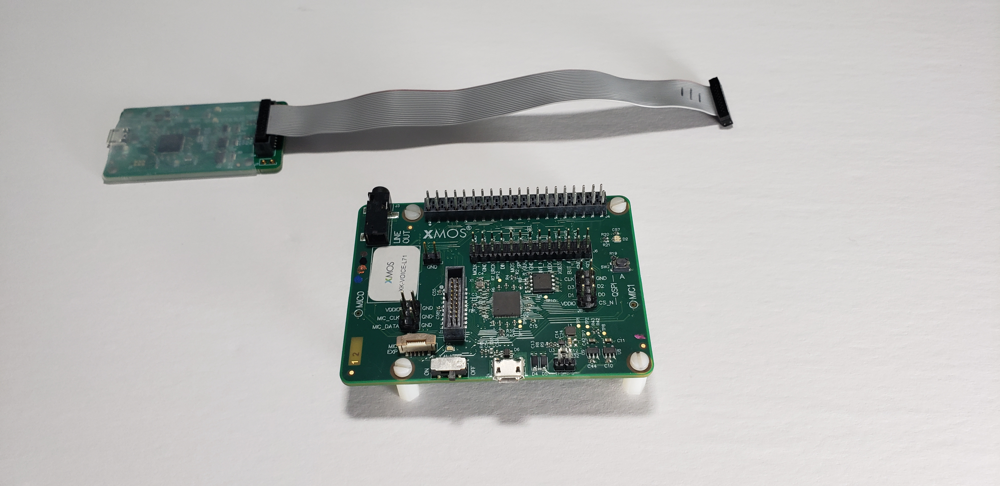

.. _sln_voice_low_power_ffd_quick_start:

#######################################
Low Power Far-field Voice Local Command
#######################################

********
Overview
********

This is the XCORE-VOICE low power far-field local control example designs demonstrating:

- Low power control/handling
- Small wake word model in SRAM
- 2-microphone far-field voice control with |I2C| or UART interface
- Audio pipeline including interference cancelling and noise suppression
- 16-phrase English language speech recognition

***************
Example designs
***************

Demonstration
=============

The low power far-field voice local command (Low Power FFD) example design targets low power
speech recognition using Sensory's TrulyHandsfree™ (THF) speech recognition and local dictionary.

When the small wake word model running on tile 1 recognizes a wake word utterance, the device
transitions to full power mode where tile 0's command model begins receiving audio samples,
continuing the command recognition process. On command recognition, the application outputs a
discrete message over |I2C| and UART.

Sensory's THF software ships with an expiring development license. It will suspend recognition
after 11.4 hours or 107 recognition events; after which, a device reset is required to resume
normal operation. To perform a reset, either power cycle the device or press the SW2 button.
Note that SW2 is only functional while in full power mode (this application is configured to hold
the device in full-power mode on such license expiration events).

**Required Hardware**

- XK-VOICE-L71 board
- XTAG4 debug adapter
- 2x USB-Micro B cables
- Host computer for programming

Hardware Setup
--------------

This example design requires an XTAG4 and XK-VOICE-L71 board.

Connect the XTAG4 to the debug header, as shown below.

.. image:: ../../shared/images/xtag_installation.jpg
  :width: 800
  :alt: xtag

Connect the both USB Micro-B connections on the XTAG4 and XK-VOICE-L71 to the programming host computer.

.. image:: ../../shared/images/host_setup.jpg
  :width: 800
  :alt: programming host setup

Running the Demonstration
-------------------------

Flashing the Firmware
^^^^^^^^^^^^^^^^^^^^^

Connect the XTAG4 via USB to the host computer running the XTC tools, and power on the board directly via USB.

On the host computer, open a ``XTC Tools Command Prompt``.

.. code-block:: console

    xflash --quad-spi-clock 50MHz --factory example_low_power_ffd.xe --boot-partition-size 0x100000 --data example_low_power_ffd_data_partition.bin

Being returned to the prompt means flashing has completed, and the XTAG4 may be disconnected.

Speech Recognition
^^^^^^^^^^^^^^^^^^

Speak one of the wake words followed by one of the commands from the lists below.

There are four LED states:

- Solid Red         = Low Power. Waiting for wake word.
- Blinking Green    = Full power. Waiting for command.
- Solid Red & Green = Full power. Processing command.
- Flickering Red    = Full power. End of evaluation (device reset required).

On startup, the application enters low power mode and waits for the wake word. Upon wake word
recognition, the device enters full power mode and waits for a command. Upon command recognition,
the device will queue the command for processing. On each wake word or command recognition, a timer
is reset (per tile). On expiration of the intent engine's timer, the device will request a transition
to low power. The other tile may reject the request in cases where its timer has not expired or other
application-specific reasons.

**Supported Wake Word**

- Hello XMOS

**Supported Commands**

- Switch on the TV
- Switch off the TV
- Channel up
- Channel down
- Volume up
- Volume down
- Switch on the lights
- Switch off the lights
- Brightness up
- Brightness down
- Switch on the fan
- Switch off the fan
- Speed up the fan
- Slow down the fan
- Set higher temperature
- Set lower temperature

|newpage|
