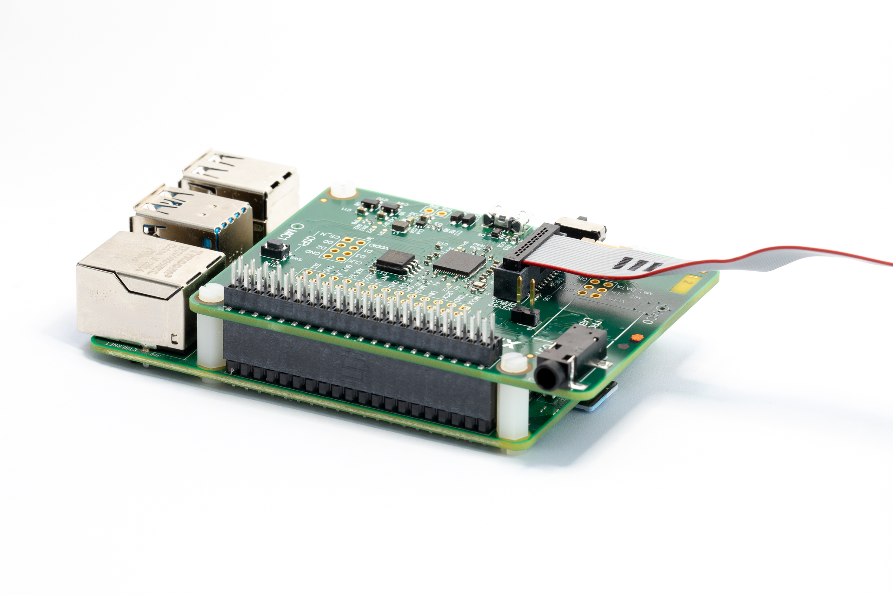
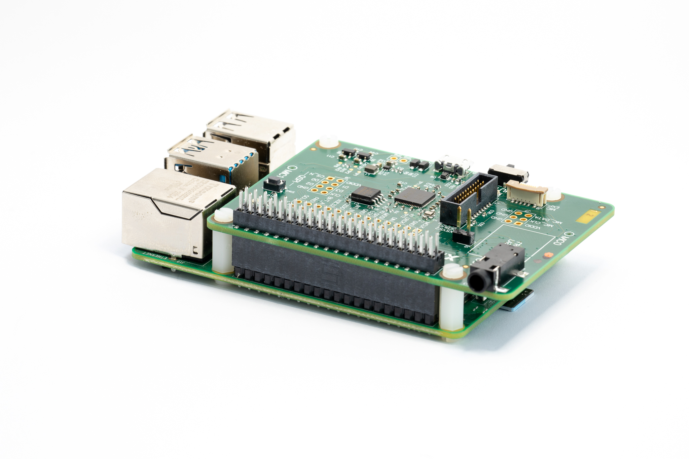

.. include:: ../substitutions.rst

.. _sln_voice_getting_started:

###############################################################################################
Getting Started with the XVF3610 Family of devices on the Voice Reference Design Evaluation Kit
###############################################################################################

.. toctree::
   :maxdepth: 1
   :hidden:
   
==============
Demonstrations
==============

XVF3610-UA - direct connection over USB to the host allowing signal analysis and evaluation
XVF3610-INT - integration into RPi system, using I2S, running an AVS client

------------------
Supported Hardware
------------------

These demos are supported on the XK-VOICE-L71 board.

---------------------------
Getting the Latest Firmware
---------------------------

The kit is shipped with the XVF3610-UA firmware pre-installed; on power up it will enumerate as a USB device (v5.1.0). Check for the latest version of the firmware here: 

    `vocalfusion-voiceinterfaces/#3610 <https://www.xmos.ai/file/xvf3610-release/>`_

To update the firmware or swap between -UA and -INT configurations follow these steps:

Download the firmware release archive from `here <https://www.xmos.ai/file/xvf3610-release/>`_ and extract.

Download the XTC Tools from xmos.ai/tools on your chosen host.

Connect either end of the ribbon cable to the XTAG4 and the other end to the XK-VOICE-L71 board as shown (Image shows piggybacked connection to RPi. Standalone operation is also supported):

---------------------
Building the Firmware
---------------------

Connect the XTAG4 via USB to the host computer running the XTC tools and power on the board (either via RPi or directly via USB).

On the host computer open a ‘XTC Tools 15.1.0 Command Prompt’.

Navigate to the directory with the extracted firmware and execute the following commands to download the two variants of firmware (replacing vX_X_X with the version required):

.. tab:: UA

    In the XVF3610-UA directory,
    
    .. code-block:: console
    
        xflash --boot-partition-size 0x100000 --factory bin/app_xvf3610_ua_vX_X_X.xe --data data-partition/images/data_partition_factory_ua_evk_vX_X_X.bin

.. tab:: INT

    In the XVF3610-INT directory,
    
    .. code-block:: console
    
        xflash --boot-partition-size 0x100000 --factory bin/app_xvf3610_int_vX_X_X.xe --data data-partition/images/data_partition_factory_int_vX_X_X.bin

===========================
Standalone UA Demonstration
===========================

.. tab:: Requirements

    XK-VOICE-L71 flashed with XVF3610-UA firmware
    Powered speaker(s) with 3.5mm jack connection
    Host system running either Windows, macOS, Linux or Android
    USB A to Micro cable for connection to the host

----------------------
Configure the Hardware
----------------------

Connect the host system to the micro-USB socket and the speakers to the jack plug as shown:

.. image:: images/getting_started/XMOS_XK_VOICE_L71_Rev2_5N2A8765_2048px.jpg
  :width: 800
  :alt: XK-VOICE-L71 connected to powered speakers and host device

Either mono or stereo speakers may be used.

---------------------
Record Captured Voice
---------------------

1. Open a music player on host PC and play a stereo file.

2. Check music is playing through powered speakers.

3. Adjust volume using music player or speakers.

4. Open Audacity and configure to communicate with kit. Input Device: XVF3610 Voice Processor and Output Device: XVF3610 Voice Processor

5. Set recording channels to 2 (Stereo) in Device

  
6. Set Project Rate to 48000Hz in Selection Toolbar.

.. image:: images/getting_started/audacity-rate.png
  :width: 800
  :alt: audacity bitrate setting
  
7. Click Record (press r) to start capturing audio streamed from XVF3610 device.

8. Talk over music; move around room while talking.

9. Stop music player.

10. Click Stop (press space) to stop recording. Audacity records single audio channel streamed from XVF3610 kit including extracted voice signal.

11. Click dropdown menu next to Audio Track and select Split Stereo To Mono.

.. image:: images/getting_started/split-track-to-mono.jpg
  :width: 800
  :alt: audacity split action dropdown
  
12. Click Solo on left channel of split processed audio. Increase Gain slider if necessary.

.. image:: images/getting_started/solo-gain.png
  :width: 800
  :alt: audacity solo and gain options
  
13. Click Play (press space) to playback processed audio.

Only your voice is audible. Playback music is removed by acoustic echo cancellation; voice is isolated by interference canceller; background noise is removed by noise suppression algorithms.

===================================
Integrated Amazon AVS Demonstration
===================================

.. tab:: Requirements

    XK-VOICE-L71 flashed with XVF3610-INT firmware
    Powered speaker(s) with 3.5mm jack connection
    Raspberry Pi model 3 or 4 with power unit
    HDMI monitor, USB keyboard and mouse
    SD card (minimum 16GB size)
    Amazon Developer Account

`Detailed instructions <https://github.com/xmos/vocalfusion-avs-setup>`_

---------------------
Assemble the Hardware
---------------------

Connect the XV-VOICE-L71 to the Raspberry Pi ensuring that the connector fully lines up, as shown below.

  
-------------------------------
Prepare the Raspberry Pi System
-------------------------------

Prepare the Raspberry Pi System image on the SD card as described on `github <https://github.com/xmos/vocalfusion-avs-setup>`_

---------------------
Connect the System
---------------------

Connect the speakers (into the XV-VOICE-71), HDMI monitor cable, and mouse as shown:

.. image:: images/getting_started/XMOS_XK_VOICE_L71_Rev2_5N2A8758_2048px.jpg
  :width: 800
  :alt: XK-VOICE-L71 in INT hardware configuration
  
---------------------
Install and Configure
---------------------

Install the Amazon Alexa SDK and configure the Raspberry Pi Audio, by following the instructions here: `Instructions <https://github.com/xmos/vocalfusion-avs-setup>`_

--------
Run Demo
--------

Once the installation is complete, the demo can be run by typing avsrun in a terminal. The demo will now operate as an Alexa virtual assistant.
