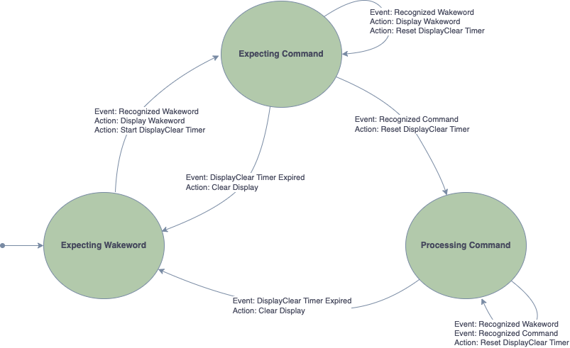

.. include:: <isonum.txt>

.. _sln_voice_Wanson:

#########################
Wanson Speech Recognition
#########################

License
=======

This software is an evaluation version only.  It includes a mechanism that limits the maximum number of recognitions to 50.

The Wanson speech recognition library is `Copyright 2022. Shanghai Wanson Electronic Technology Co.Ltd (&quot;WANSON&quot;)` and is subject to the `Wanson Restrictive License <https://github.com/xmos/sln_voice/tree/develop/applications/ffd/inference/wanson/lib/LICENSE.md>`__.

Overview
========

The Wanson speech recognition engine runs proprietary models to identify keywords in an audio stream.

The model used in FFD is approximately 185k.  The runtime and application supporting code consumes approximately 250k.

The Wanson engine requires at a core frequency of at least 400 MHz to keep up with real time.

To replace the Wanson engine with a different engine, refer to the FFD documentation on :ref:`sln_voice_FFD_replacing-wanson-keyword-engine-block`

Dictionary command table
========================

.. list-table:: English langauge demo
   :widths: 100 50 50
   :header-rows: 1
   :align: left

   * - Utterances
     - Type
     - Return code (decimal)
   * - Hello XMOS
     - keyword
     - 100
   * - Hello Wanson
     - keyword
     - 110
   * - Switch on the TV
     - command
     - 200
   * - Switch off the TV
     - command
     - 210
   * - Channel up
     - command
     - 220
   * - Channel down
     - command
     - 230
   * - Volume up
     - command
     - 240
   * - Volume down
     - command
     - 250
   * - Switch on the lights
     - command
     - 300
   * - Switch off the lights
     - command
     - 310
   * - Brightness up
     - command
     - 320
   * - Brightness down
     - command
     - 330
   * - Switch on the fan
     - command
     - 400
   * - Switch off the fan
     - command
     - 410
   * - Speed up the fan
     - command
     - 420
   * - Slow down the fan
     - command
     - 430
   * - Set higher temperature
     - command
     - 440
   * - Set lower temperature
     - command
     - 450

State Machine
=============

An optional state machine is used to condition the raw output of the Wanson speech engine.

When using the state machine, the application intent callback will only occur when a wake word and command have been detected within a time period.

The state machine logic can be disabled by setting the compile time option appconfINFERENCE_RAW_OUTPUT, to 1.  The wake word to command timeout is compile time configurable via appconfINFERENCE_RESET_DELAY_MS.

More information on these options can be found in the FFD :ref:`sln_voice_FFD_configuring-the-firmware` section.

Application Integration
=======================

In depth information on out of the box integration can be found here: :ref:`sln_voice_ffd_host_integration`
