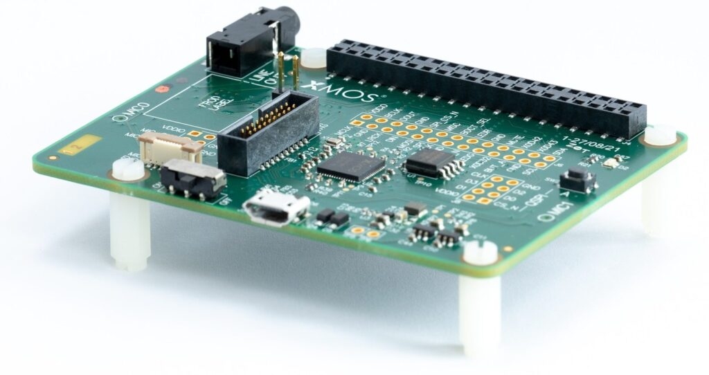

.. include:: <isonum.txt>
.. include:: doc/substitutions.rst

.. _sln_voice_user_guide:

############################
XCORE |reg| -VOICE Solutions
############################

.. toctree::
   :maxdepth: 3
   :hidden:

   doc/ffd
   doc/stlp
   doc/copyright

XMOS Solutions are a combination of the XCORE SDK and Reference Designs, ready to run on our development kits, and targeting a range of voice assistant and voice control applications.

On GitHub
---------

Get the latest version from `sln_voice <https://github.com/xmos/sln_voice>`_

Follow the **README** how to clone this repo.

Checkout the tagged versions for the latest stable release.

Reference Designs
-----------------

.. list-table:: Voice Solutions - reference designs
    :widths: 50 100 100 100
    :header-rows: 1
    :align: left

    * - Title
      - Description
      - Development kit
      - Go to the code
    * - :ref:`sln_voice_FFD` 
      - - 2-microphone far-field voice control with |I2C| or UART interface 
        - Audio pipeline includes interference cancelling and noise supression 
        - 25-phrase English language voice recognition
      - `XK-VOICE-L71 <https://www.digikey.co.uk/en/products/detail/xmos/XK-VOICE-L71/15761172>`__
      - `applications/ffd <https://github.com/xmos/sln_voice/tree/develop/applications/ffd>`__
    * - :ref:`sln_voice_STLP`
      - - 2-microphone far-field voice assistant front-end
        - Audio pipeline includes echo cancelation, interference cancelling and noise suppression
        - Stereo reference input and voice assistant output each supported as |I2C| or USB (UAC2.0)    
      - `XK-VOICE-L71 <https://www.digikey.co.uk/en/products/detail/xmos/XK-VOICE-L71/15761172>`__
      - `applications/stlp <https://github.com/xmos/sln_voice/tree/develop/applications/stlp>`__
Development Tools
-----------------

Download and install the XCore `XTC Tools <https://www.xmos.ai/software-tools/>`_ version 15.1.0 or newer. If you already have the XTC Toolchain installed, you can check the version with the following command:

    xcc --version

Build and install the `XCORE SDK host application tools <https://www.xmos.ai/documentation/XM-014660-PC-LATEST/html/doc/quick_start/installation.html#step-2-install-host-applications>`__. 

XMOS Devices
------------

The XK-VOICE-L71 is based on the: `XU316-1024-QF60A <https://www.xmos.ai/download/XU316-1024-QF60A-xcore.ai-Datasheet(22).pdf>`_

Learn more about the `The XMOS XS3 Architecture <https://www.xmos.ai/download/The-XMOS-XS3-Architecture(5).pdf>`_

Licensing
---------

This Software is subject to the terms of the `XMOS Public Licence: Version 1 <https://github.com/xmos/sln_voice/blob/develop/LICENSE.rst>`_. Copyrights and licenses for third party components can be found in `Copyrights and Licenses <https://github.com/xmos/sln_voice/blob/develop/doc/copyright.rst>`_.